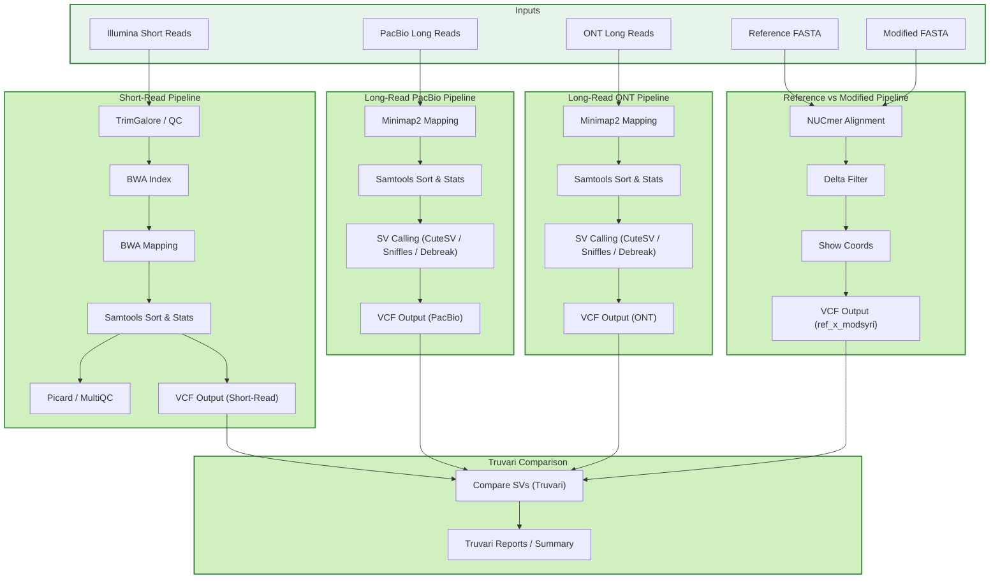

# EFSA Pipeline

## Table of Contents
- [Docker Container](#docker-container)
- [Input Validation](#input-validation)
- [Nextflow](#nextflow)
   - [Running the Pipeline](#running-the-pipeline)
   - [🔄 Pipeline Runtime Messages & Mapping Summary](#-pipeline-runtime-messages--mapping-summary)
      - [Runtime Status Messages](#runtime-status-messages)
      - [📊 Unmapped Reads Statistics](#-unmapped-reads-statistics)
      - [✅ Pipeline Execution Summary](#-pipeline-execution-summary)
      - [ℹ️ Removal of the Nextflow `work/` Directory](#removal-of-the-nextflow-work-directory)
   - [📁 `data/valid` Directory Structure](#-datavalid-directory-structure)
   - [📁 `data/outputs` Directory Structure](#-dataoutputs-directory-structure)
      - [`fasta_ref_mod/`](#fasta_ref_mod)
      - [`illumina/`](#illumina)
      - [`pacbio/ and ont/`](#pacbio-and-ont)
      - [`truvari/`](#truvari)
      - [`unmapped_stats/`](#unmapped_stats)
  - [Graphical Representation of the Pipeline](#graphical-representation-of-the-pipeline)
      


# Docker Container

## Docker Setup for Users

This guide shows you how to run the EFSA Pipeline in a Docker container with access to input/output folders.

## Prerequisites

- Docker installed on your system
- Git (if cloning the repository)

## Quick Start

### Option 1: Using the Run Script (Recommended)

1. Make sure the script is executable:
   ```bash
   chmod +x run_container.sh
   ```

2. Run the container:
   ```bash
   ./run_container.sh
   ```

3. You'll be dropped into the container shell where you can run CLI commands
4. Type `exit` when done to return to your host system


### Option 2: Manual Docker Commands

1. Build the image:
   ```bash
   docker build -t efsa-pipeline .
   ```

2. Run interactively:
   ```bash
   docker run --privileged -d --rm \
    --network=host \
    -v /etc/ssl/certs:/etc/ssl/certs:ro \
    -v /usr/share/ca-certificates:/usr/share/ca-certificates:ro \
    --name efsa-pipeline-container \
    -w "$WORKSPACE_PATH" \
    -v "$WORKSPACE_PATH:$WORKSPACE_PATH" \
    $INPUT_MOUNT \
    efsa-pipeline

   docker exec -it efsa-pipeline-container /bin/sh
   ```

# Input Validation

> **Important**
> 
> When container is build please follow the steps to preprocess the data with a validation package.
>

The input validation module preprocesses and verifies all input data to ensure it meets the required format and structure before the Nextflow pipeline is executed.

# Nextflow

Please run the `docker login` command that is given in the efsa Slack channel - Nextflow notes.

## Running the Pipeline

The main pipeline (`main.nf`) executes **all three workflows** in sequence.
Each workflow can also be executed individually if required.

---

### Running Main Workflow

This executes **short-read processing**, **long-read processing**, and **reference vs modified genome comparison**:

```bash
nextflow run main.nf \
  -process.containerOptions "-u $(id -u):$(id -g)" \
  --max_cpu $(nproc) \
  -resume
```


### Available Options

| Option         | Description                                  | Default                |
| -------------- | -------------------------------------------- | ---------------------- |
| `-resume`      | Resume pipeline from last successful process | –                      |
| `--in_dir`     | Input directory                              | `data/valid`           |
| `--out_dir`    | Output directory                             | `data/outputs`         |
| `--registry`   | Docker/Singularity container registry        | `ghcr.io/kate-simonova`|
| `--max_cpu`    | Maximum CPUs per process                     | `1`                    |
| `--log`        | Enable logging                               | `true`                 |
| `--clean_work` | Remove work directory after successful run   | `true`                 |
| `--help`       | Display help message                         | –                      |

---

### Running Individual Pipelines

You can also run each of the three sub-pipelines independently.

#### Short-read Processing

For Illumina short-read data:

```bash
nextflow run workflows/short-read-ref.nf \
  -process.containerOptions "-u $(id -u):$(id -g)" \
  --max_cpu $(nproc) \
  -resume
```

#### Long-read Processing

For Oxford Nanopore / PacBio long reads:

```bash
nextflow run workflows/long-read-ref.nf \
  -process.containerOptions "-u $(id -u):$(id -g)" \
  --max_cpu $(nproc) \
  -resume
```

#### Reference vs Modified Genome Comparison

For comparing reference and modified FASTA assemblies:

```bash
nextflow run workflows/fasta_ref_x_mod.nf \
  -process.containerOptions "-u $(id -u):$(id -g)" \
  --max_cpu $(nproc) \
  -resume
```


## 🔄 Pipeline Runtime Messages & Mapping Summary

During execution, the pipeline prints progress messages indicating which workflow is currently running and what type of reads are being processed.

### Runtime Status Messages

When the pipeline is running, you will see real-time messages like:

```text
ℹ️  Running pipeline: processing long-pacbio reads → mapping to the reference & modified fasta.

ℹ️  Running pipeline: processing long-ont reads → mapping to the reference & modified fasta.

ℹ️  Running pipeline: processing short reads → mapping to the reference & modified fasta.

ℹ️  Truvari: performing 3 comparisons.
```

These messages help track the execution order and confirm that all three pipelines are being executed as expected.

---

### 📊 Unmapped Reads Statistics

After mapping, the pipeline reports the number and percentage of **unmapped reads** for each analysis.
This is useful for assessing mapping efficiency and data quality.

#### Example Output

```text
📊 short-mod mapping:
    Unmapped reads: 19,880 (2.06%)
    Total input reads: 963,427

📊 short-ref mapping:
    Unmapped reads: 25,360 (2.63%)
    Total input reads: 963,362

📊 short-ref-plasmid mapping against plasmid:
    Unmapped reads: 4,677 (0.49%)
    Total input reads: 963,362

📊 ont/long-ref mapping:
    Unmapped reads: 52,745 (3.04%)
    Total input reads: 1,732,734

📊 ont/long-mod mapping:
    Unmapped reads: 48,145 (2.64%)
    Total input reads: 1,825,876

📊 pacbio/long-mod mapping:
    Unmapped reads: 41,596 (2.28%)
    Total input reads: 1,826,736

📊 pacbio/long-ref mapping:
    Unmapped reads: 47,472 (2.74%)
    Total input reads: 1,733,973
```

#### Interpretation

* **Unmapped reads** represent sequences that did not align to the provided reference or modified FASTA files.
* A low percentage of unmapped reads indicates:

  * High mapping quality
  * Good reference/assembly quality
  * Low contamination or sequencing errors

If the percentage of unmapped reads is unusually high, this may indicate:

* Poor read quality
* Inadequate or incomplete reference
* Contamination
* Incorrect input file selection


### ✅ Pipeline Execution Summary

The Nextflow pipelines ran successfully and produced the expected outputs. Each step completed without errors:

```text
✅ The reference to modified fasta comparision processing pipeline completed successfully.

✅ The long-ref processing pipeline completed successfully.

✅ The short-ref processing pipeline completed successfully.

✅ Truvari: the comparison of vcf files finished successfully.

✅ Execution of main.nf processing pipeline completed successfully.
```


### ℹ️ Removal of the Nextflow `work/` Directory

When the pipeline is executed with the parameter:

```text
params.clean_work = true
```

Nextflow automatically removes the temporary `work/` directory after successful completion.

```text
ℹ️ Nextflow `work/` directory was removed.
```

**Notes:**

* The `work/` directory contains intermediate files and temporary outputs generated during pipeline execution.
* Removing it saves disk space while retaining all final results in the `out_dir`.
* If you want to keep intermediate files for debugging or inspection, set: `params.clean_work = false`


## 📁 `data/valid` Directory Structure

This directory contains all input data used by the Nextflow pipeline.
```
data/valid/
├── assembled_genome.fasta
├── reference_genome.fasta
├── ref_plasmid.fa             # Reference plasmid sequences (if used)
├── mod_plasmid.fa             # Modified/assembled plasmid sequences (if used)
├── ref_feature.gff            # Genome annotation file GTF/GFF (if used)
│
├── illumina/                  
│   ├── SampleName_1.fastq.gz  
│   ├── SampleName_2.fastq.gz  
│
├── ont/                       
│   └── SampleName.fastq.gz
│
└── pacbio/                   
    └── SampleName.fastq.gz

```

| File / Folder            | Description                                           |
| ------------------------ | ----------------------------------------------------- |
| `reference_genome.fasta` | The primary reference genome sequence.                |
| `assembled_genome.fasta` | Assembled or modified genome for comparison/analysis. |
| `ref_plasmid.fa`         | Reference plasmid sequences.                          |
| `mod_plasmid.fa`         | Modified or assembled plasmid sequences.              |
| `ref_feature.gff`        | GFF feature file for annotations.                     |
| `illumina/`              | Paired-end Illumina short reads.                      |
| `ont/`                   | Oxford Nanopore long reads.                           |
| `pacbio/`                | PacBio long reads.                                    |


| Data Type       | Supported Extensions                   |
| --------------- | -------------------------------------- |
| FASTA sequences | `.fa`, `.fna`, `.fasta`                |
| GFF annotations | `.gff`, `.gtf`                         |
| FASTQ reads     | `.fastq`, `.fq`, `.fastq.gz`, `.fq.gz` |

## 📁 `data/outputs` Directory Structure

After successful pipeline execution, the outputs are organized as follows:

```
data/outputs
├── fasta_ref_mod       → Results from reference vs modified FASTA comparison
├── illumina            → Short-read (Illumina) mapping results
├── logs                → Pipeline logs and Nextflow reports
├── ont                 → Long-read (Oxford Nanopore) mapping results
├── pacbio              → Long-read (PacBio) mapping results
├── truvari             → Variant comparison results from Truvari
└── unmapped_stats      → Summary statistics of unmapped reads for each workflow

```

### `fasta_ref_mod/`

This folder contains results from the **reference vs modified FASTA comparison pipeline**:

```
fasta_ref_mod/
├── ref_x_mod.delta
├── ref_x_mod.filtered.coords
├── ref_x_mod_filtered.delta
└── ref_x_modsyri.vcf
```

**Description of files:**

* `ref_x_mod.delta`
  Raw alignment difference file between reference and modified FASTA (generated by `nucmer`/MUMmer).

* `ref_x_mod.filtered.coords`
  Filtered alignment coordinates showing high-confidence matches and structural differences.

* `ref_x_mod_filtered.delta`
  Cleaned and filtered delta file used for downstream structural comparison.

* `ref_x_modsyri.vcf`
  Structural variants and genome rearrangements detected by **SyRI**, stored in VCF format.


### `illumina/`

This folder contains the full output of the **Illumina short-read processing pipeline**, including read quality control, trimming, genome mapping, and variant analysis.

```
data/outputs/illumina/
├── qc_trimming
│   ├── fastqc_out
│   ├── multiqc
│   └── trimmed_reads
├── short-mod
│   ├── bam
│   ├── bwa_index
│   ├── multiqc
│   ├── picard
│   ├── samtools_stats
│   └── unmapped
├── short-ref
│   ├── bam
│   ├── bcftools_stats
│   ├── bwa_index
│   ├── multiqc
│   ├── picard
│   ├── samtools_index_dict
│   ├── samtools_stats
│   ├── unmapped
│   └── vcf
└── short-ref-plasmid
    ├── bam
    ├── bwa_index
    ├── multiqc
    ├── picard
    ├── samtools_stats
    └── unmapped
```


#### Subfolder Structure

#### `qc_trimming/`

This directory contains all quality control and preprocessing outputs generated from raw Illumina reads.

* `fastqc_out/`
  Raw read quality reports (per-sample) generated by **FastQC**.

* `multiqc/`
  Aggregated quality control report summarizing all FastQC results.

* `trimmed_reads/`
  Quality-filtered and adapter-trimmed reads used for downstream mapping.

---

#### `short-ref/`

This folder contains Illumina reads mapped to the **reference genome**.

Includes:

* `bam/` — Sorted and indexed BAM alignment files
* `bwa_index/` — Precomputed BWA reference genome indices
* `samtools_index_dict/` — FASTA index and sequence dictionary files
* `samtools_stats/` — Alignment and coverage statistics
* `picard/` — Insert size, duplication, and library QC metrics
* `bcftools_stats/` — Variant calling summary statistics
* `vcf/` — Variant calls generated from short reads
* `multiqc/` — Combined QC report from mapping and alignment metrics
* `unmapped/` — Reads that failed to align to the reference genome

---

#### `short-ref-plasmid/`

This folder contains mapping results of Illumina reads against the **reference plasmid sequence**.

Includes:

* `bam/` — Aligned reads mapped to the plasmid
* `bwa_index/` — Plasmid reference index files
* `samtools_stats/` — Mapping statistics
* `picard/` — Alignment and library QC
* `multiqc/` — Summary report
* `unmapped/` — Reads not mapping to the plasmid

This folder allows evaluation of plasmid presence and coverage independently of the main genome.

---

#### `short-mod/`

Contains Illumina read alignments against the **modified/assembled genome**.

Includes:

* `bam/` — Sorted BAM files for modified genome mapping
* `bwa_index/` — Modified genome BWA index
* `samtools_stats/` — Mapping and coverage statistics
* `picard/` — Alignment QC metrics
* `multiqc/` — Combined reports
* `unmapped/` — Reads that failed to align to the modified genome

### `pacbio/` and `ont/`

These two folders contain the complete results from the **long-read analysis pipeline** using:

* **PacBio** reads OR
* **Oxford Nanopore Technologies (ONT)** reads

Both follow the **same folder structure** and processing logic.

```
data/outputs/ont/
data/outputs/pacbio/
├── long-mod
│   ├── bam
│   ├── minimap2
│   └── unmapped
├── long-ref
│   ├── bam
│   ├── bcftools_stats
│   ├── cutesv_out
│   ├── debreak_out
│   ├── minimap2
│   ├── sniffles_out
│   ├── survivor_out
│   └── unmapped
├── long-ref-plasmid
│   ├── bam
│   ├── minimap2
│   └── unmapped
└── nanoplot
    └── SampleName_report
```


#### `long-ref/`

Contains all outputs generated by mapping long reads to the **reference genome**.

Includes:

* `bam/`
  Sorted and indexed **BAM alignment files** of long reads mapped to the reference genome.

* `minimap2/`
  Mapping logs, alignment summaries, and statistics produced during mapping with **minimap2**.

* `bcftools_stats/`
  Summary statistics of detected variants after variant calling.

* `cutesv_out/`
  Structural variants called using **cuteSV**.

* `sniffles_out/`
  Structural variants called using **Sniffles**.

* `debreak_out/`
  Structural variants detected using **DeBreak**.

* `survivor_out/`
  Merged structural variant callsets generated by **SURVIVOR**.

* `unmapped/`
  Long reads that failed to align to the reference genome.

---

#### `long-ref-plasmid/`

Contains mapping results of long reads against the **reference plasmid sequence**.

Includes:

* `bam/` — Plasmid-mapped long-read alignments
* `minimap2/` — Mapping logs and stats
* `unmapped/` — Reads that did not map to the plasmid


---

#### `long-mod/`

Contains alignments of long reads mapped to the **modified/assembled genome**.

Includes:

* `bam/` — Sorted alignment files
* `minimap2/` — Mapping outputs and statistics
* `unmapped/` — Reads that failed to align to the modified genome

This enables comparison between mapping reads on reference vs modified assemblies.

---

#### `nanoplot/`

Contains long-read quality control and summary statistics generated using **NanoPlot**.

Example content:

* `SampleName_report/`

Inside this folder you typically find:

* Read length distributions
* N50 / N90 statistics
* Quality score profiles
* Read length vs quality plots
* Summary statistics of long-read sequencing quality

Sure — here is the **final README-ready section** with both the **folder structure** and the **clear description of results** for `truvari` and `unmapped_stats`, without changing your original names.

---

Sure — here is your **Truvari section rewritten using `SampleName` placeholders**, so it’s generic, reusable, and clean for public documentation.

---

### `truvari/`

#### Folder Structure

```
truvari
├── SampleName_sv_short_read.vcf.gz
├── SampleName_sv_short_read.vcf.gz.csi
├── SampleName.pacbio_sv_long_read.vcf.gz
├── SampleName.pacbio_sv_long_read.vcf.gz.csi
├── SampleName.ont_sv_long_read.vcf.gz
├── SampleName.ont_sv_long_read.vcf.gz.csi
├── ref_x_modsyri.vcf.gz
├── ref_x_modsyri.vcf.gz.csi
├── ref_x_modsyri_SampleName_sv_short_read_truvari
├── ref_x_modsyri_SampleName.pacbio_sv_long_read_truvari
└── ref_x_modsyri_SampleName.ont_sv_long_read_truvari
```

---

#### Description

This folder contains all structural variant (SV) callsets and their **Truvari benchmarking results** comparing SVs detected from sequencing data with the structural variants derived from the **reference vs modified genome comparison (SyRI)**.

---

#### Reference SV Callsets

* `ref_x_modsyri.vcf.gz`
  Structural variants derived from comparing the **reference genome** and the **modified genome** using **SyRI**.

* `SampleName_sv_short_read.vcf.gz`
  Structural variants detected from **Illumina short reads**.

* `SampleName.pacbio_sv_long_read.vcf.gz`
  Structural variants detected from **PacBio long reads**.

* `SampleName.ont_sv_long_read.vcf.gz`
  Structural variants detected from **Oxford Nanopore long reads**.

All `.csi` files represent index files for fast querying of VCF contents.

---

### Truvari Comparison Result Folders

Each Truvari output directory contains benchmarking results comparing the **SyRI structural variants** against sequencing-based SV calls:

* `ref_x_modsyri_SampleName_sv_short_read_truvari/`
  Comparison between SyRI SVs and SVs called from **Illumina short reads**.

* `ref_x_modsyri_SampleName.pacbio_sv_long_read_truvari/`
  Comparison between SyRI SVs and SVs called from **PacBio long reads**.

* `ref_x_modsyri_SampleName.ont_sv_long_read_truvari/`
  Comparison between SyRI SVs and SVs called from **Oxford Nanopore long reads**.

Each Truvari output folder usually contains:

* Matched SV calls
* Unmatched (false negative / false positive) calls
* Precision, recall, and F1 scores
* Comparison summary statistics


### `unmapped_stats/`

#### Folder Structure

```
unmapped_stats
├── SampleName_short_read_stats.txt
├── SampleName_pacbio_read_stats.txt
└── SampleName_ont_read_stats.txt
```

---

#### Description

This folder contains read mapping comparisons between the reference genome and the modified/assembled genome.
It helps evaluate how many reads map consistently to both assemblies and how many show assembly-specific behavior.

Each file summarizes:

* Reads mapping to both reference and modified assemblies
* Reads mapping only to reference
* Reads mapping only to modified
* Used to compare assembly quality and detect assembly-related differences

| File                               | Description                                                                                |
| ---------------------------------- | ------------------------------------------------------------------------------------------ |
| `SampleName_short_read_stats.txt`  | Mapping comparison of Illumina short reads between reference and modified assemblies       |
| `SampleName_pacbio_read_stats.txt` | Mapping comparison of PacBio long reads between reference and modified assemblies          |
| `SampleName_ont_read_stats.txt`    | Mapping comparison of Oxford Nanopore long reads between reference and modified assemblies |


Each report includes:

* Total input reads
* Number of unmapped reads
* Percentage of unmapped reads
* Mapping target (reference or modified genome)

### File Content 

Each mapping statistics (`SampleName_short_read_stats.txt`) file includes:
```
Pair IDs: <sample> reference vs <sample> modified
Intersected Reads: <number>
Unique Reads <sample> reference: <number>
Unique Reads <sample> modified: <number>
```

Here’s a clean, README-ready **description for the `logs/` folder**:

---
Thanks! Based on the exact contents you shared, here’s a **detailed description for the `logs/` folder** that you can use in your README:

---

### `logs/` — Nextflow Command and Log Files

#### Folder Contents

```
logs/
├── .command.begin    # Timestamp file marking the start of a process
├── .command.err      # Captures standard error output from the process
├── .command.log      # Logs process execution messages from Nextflow
├── .command.out      # Captures standard output from the process
├── .command.run      # Execution metadata (exit status, runtime, resources)
└── .command.sh       # The shell script containing the exact commands executed
```

#### Description

The `logs/` folder contains **detailed logs and command scripts** for each Nextflow process.

* **`.command.begin`** — Marks the start time of a process.
* **`.command.err`** — Captures standard error messages generated by the process.
* **`.command.log`** — General execution logs from Nextflow for the process.
* **`.command.out`** — Captures standard output of the process.
* **`.command.run`** — Metadata about process execution (e.g., exit code, runtime, resource usage).
* **`.command.sh`** — The shell script that Nextflow runs; contains the exact commands for the process.

## Graphical Representation of the Pipeline

