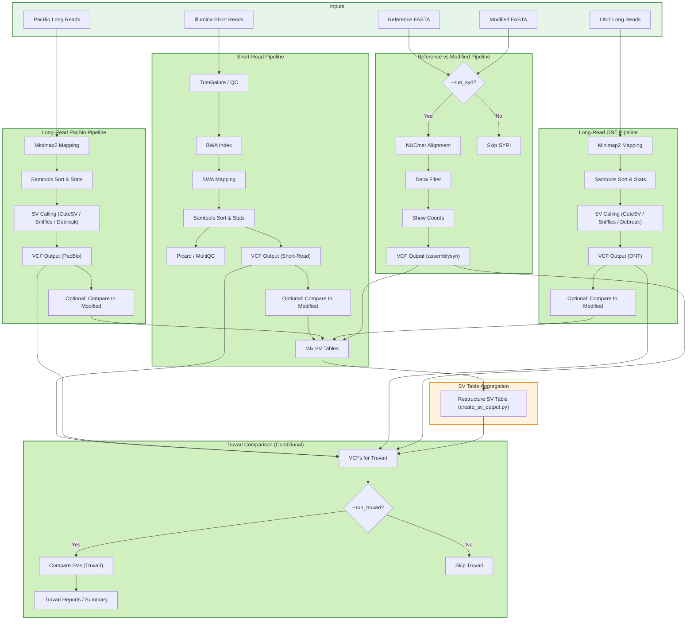
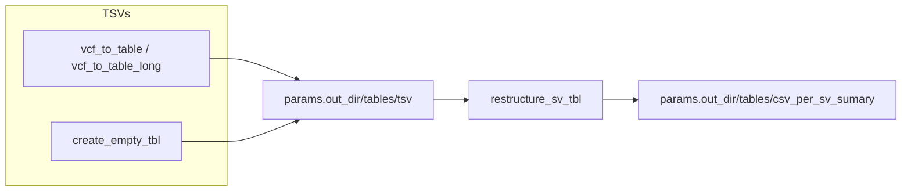
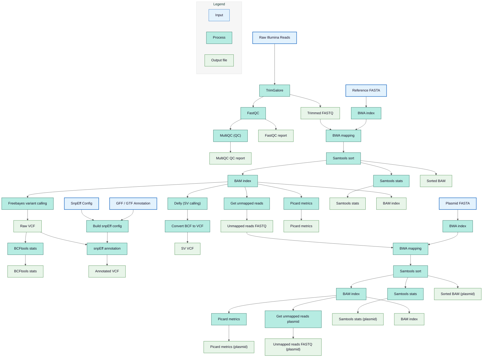
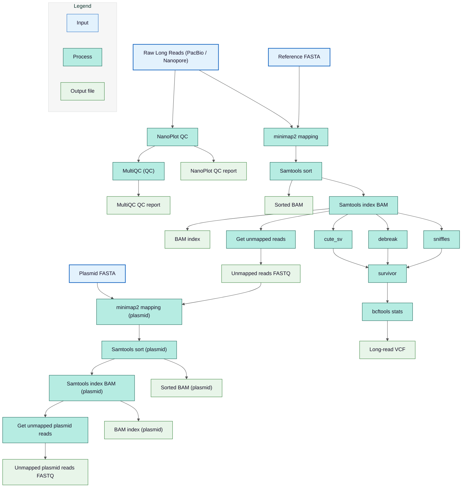
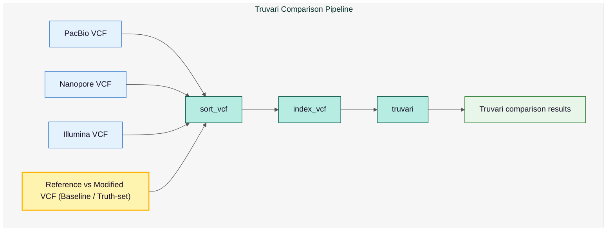
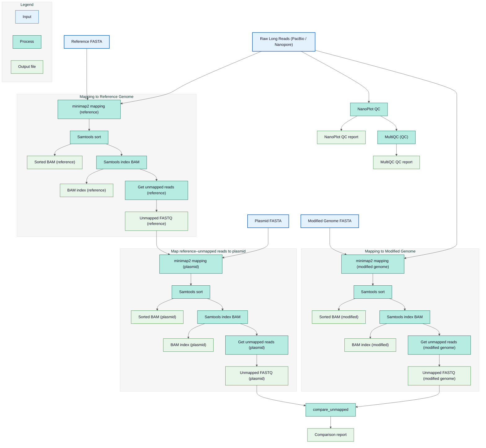
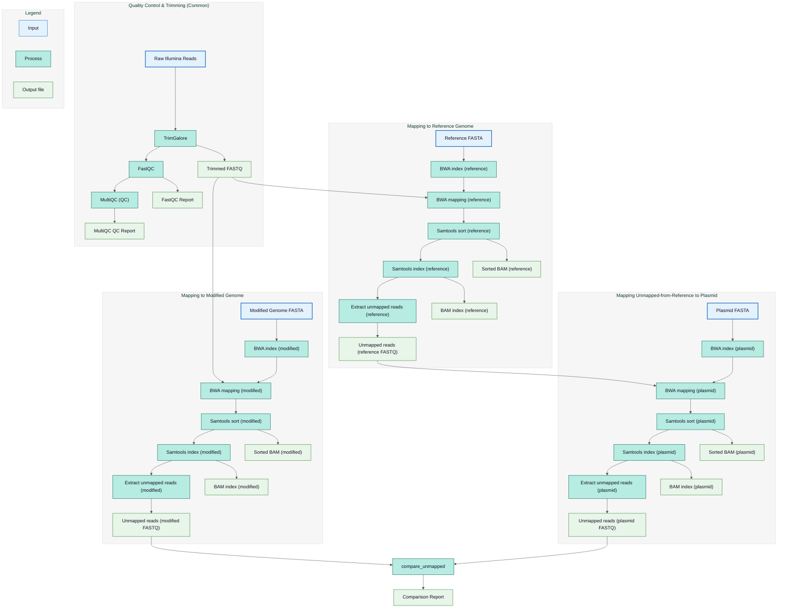

# EFSA Pipeline

## Table of Contents
- [Quick Start](#quick-start)
- [Docker Container](#docker-container)
- [Input Validation](#input-validation)
- [Nextflow](#nextflow)
   - [Running the Pipeline](#running-the-pipeline)
   - [🔄 Pipeline Runtime Messages & Mapping Summary](#-pipeline-runtime-messages--mapping-summary)
      - [Runtime Status Messages](#runtime-status-messages)
      - [📊 Unmapped Reads Statistics](#-unmapped-reads-statistics)
      - [✅ Pipeline Execution Summary](#-pipeline-execution-summary)
      - [Removal of Nextflow Work Directory](#removal-of-nextflow-work-directory)
   - [📁 `data/valid` Directory Structure](#-datavalid-directory-structure)
   - [📁 `data/outputs` Directory Structure](#-dataoutputs-directory-structure)
      - [`fasta_ref_mod/`](#fasta_ref_mod)
      - [`illumina/`](#illumina)
      - [`pacbio/ and ont/`](#pacbio-and-ont)
      - [`truvari/`](#truvari)
      - [`unmapped_stats/`](#unmapped_stats)
  - [Graphical Representation of the Pipeline](#graphical-representation-of-the-pipeline)
  - [Generation of per structural variation (SV) type CSV tables](#generation-of-per-structral-variation-sv-type-csv-tables)
- [Changelog](#changelog)
      

# Quick Start

1. **Download the repository**:

   ```bash
   git clone https://github.com/denisHanch/efsa_pipeline.git
   ```

> **Important!**
> 
> Make sure that the data for pipelines are in the folder `data/inputs`.
>

2. **Start the Docker container**:

   ```bash
   ./run_container.sh
   ```

> **Important!**
> 
> Create configuration file `config.json` on `data/inputs`.
> 

3. **Running QC** on the input data and **processing data for the Nextflow pipeline** to `data/valid` folder:

   ```bash
   validate
   validate --config <path>
   ```

4.  Start the pipeline with a command:

   ```bash
   nextflow run main.nf --max_cpu $(nproc)  -params-file data/valid/validated_params.json  -resume
   ```


# Docker Container

## Docker Setup for Users

This guide shows you how to run the EFSA Pipeline in a Docker container with access to input/output folders.

## Prerequisites

- Docker installed on your system
- Git (if cloning the repository)

## Quick Start

### Option 1: Using the Run Script (Recommended)

1. Make sure the script is executable:
   ```bash
   chmod +x run_container.sh
   ```

2. Run the container:
   ```bash
   ./run_container.sh
   ```

3. You'll be dropped into the container shell where you can run CLI commands
4. Type `exit` when done to return to your host system


### Option 2: Manual Docker Commands

1. Build the image:
   ```bash
   docker build -t efsa-pipeline .
   ```

2. Run interactively:
   ```bash
   docker run --privileged -d --rm \
    --network=host \
    -v /etc/ssl/certs:/etc/ssl/certs:ro \
    -v /usr/share/ca-certificates:/usr/share/ca-certificates:ro \
    --name efsa-pipeline-container \
    -w $(pwd) \
    -v "$(pwd)/data/inputs:/EFSA_workspace/data/inputs" \
    efsa-pipeline

   docker exec -it efsa-pipeline-container /bin/sh
   ```

# Input Validation

## Input Scenarios and Preprocessing Logic

The validation module not only verifies input formats, but also determines how genome assemblies are interpreted and preprocessed before entering the pipeline.

Depending on the structure of `ref.fa` and `mod.fa`, different strategies are applied for:
- chromosome and plasmid separation
- contig handling
- usage of minimap2 for sequence mapping
- preparation of files in `data/valid/`

The following table summarizes all supported scenarios:

| #     | Scenario                                                  | Type (`config.json`)       | Input Structure                                                                                | Plasmids Handling                                                                                                                                               | `run_ref_x_mod` | **minimap2 Mapping**                                              | mod.fa Processing                                                                                          | Modules Run          | Output in `data/valid/`                                                      |
| ----- | --------------------------------------------------------- | -------------------------- | ---------------------------------------------------------------------------------------------- | --------------------------------------------------------------------------------------------------------------------------------------------------------------- | --------------- | ----------------------------------------------------------------- | ---------------------------------------------------------------------------------------------------------- | -------------------- | ---------------------------------------------------------------------------- |
| **1** | Single contig + plasmids                      | `prokaryote`               | **ref.fa:** 1 sequence (+ optional plasmids) <br> **mod.fa:** 1 sequence (+ optional plasmids) | In **ref.fa**: <br> - Longest sequence → chromosome <br> - Remaining → plasmids <br><br> In **mod.fa**: plasmids = sequences **not mapped** to reference    | True            | **Used** to identify unmapped regions (plasmids in mod.fa)        | Reduced to **1 contig** (chromosome only)                                                                  | All modules          | `ref.fa`, `mod.fa` (1 contig) <br> `*_contig_0.fasta` <br> `*_plasmid.fasta` |
| **2** | Fragmented assembly (below limit)             | `prokaryote`               | **ref.fa:** 1 sequence <br> **mod.fa:** multiple sequences (≤ limit)                           | In reference: <br> - Longest = chromosome <br> - Rest = plasmids <br><br> In **mod.fa**: <br> - Unmapped sequences → plasmids <br> - Mapped sequences → contigs | True            | **Used** to split mod.fa into mapped contigs vs unmapped plasmids | - Split into individual contigs (`*_contig.fasta`) <br> - `mod.fa` becomes multifasta **without plasmids** | All modules          | `ref.fa`, `mod.fa` + contig set <br> `*_contig.fasta` <br> `*_plasmid.fasta` |
| **3** | Fragmented assembly (above limit)             | `prokaryote`               | **ref.fa:** 1 sequence <br> **mod.fa:** multiple sequences (> limit)                           | In reference: <br> - Longest = chromosome <br> - Rest → `*ref_plasmid.fasta` <br><br> In **mod.fa**: no plasmid detection                                       | False           | **Not used**                                                      | No processing (mod.fa copied as-is)                                                                        | Mapping-only modules | `ref.fa`, `mod.fa` (copied) <br> `*_plasmid.fasta`                           |
| **4** | Multiple sequences in reference  | `prokaryote` / `eukaryote` | **ref.fa:** multiple sequences (non-plasmid) <br> **mod.fa:** one or more sequences            | No plasmids considered                                                                                                                                          | False           | **Not used**                                                      | No processing (files copied as-is)                                                                         | Mapping-only modules | `ref.fa`, `mod.fa` (copied)                                                  |


> **Important!**
> 
> When container is build please follow the steps to preprocess the data with a validation package.
>

The input validation module preprocesses and verifies all input data to ensure it meets the required format and structure before the Nextflow pipeline is executed.

## Supported File Formats


### Genome Files
| Supported Input Formats | Final Output Format |
|------------------------|---------------------|
| FASTA: `.fasta`, `.fa`, `.fna` | `.fasta` |
| GenBank: `.gb`, `.gbk`, `.genbank` | `.fasta` |
| Compression: `.gz`, `.bz2`, `.gzip`, `.bzip2` | Uncompressed |

### Read Files
| Supported Input Formats | Final Output Format |
|------------------------|---------------------|
| FASTQ: `.fastq`, `.fq` | `.fastq` |
| BAM: `.bam` (limited support) | `.bam` |
| Compression: `.gz`, `.bz2`, `.gzip`, `.bzip2` | `.gz` |

### Feature Files
| Supported Input Formats | Final Output Format |
|------------------------|---------------------|
| GFF: `.gff`, `.gff3`, `.gtf` | `.gff3` |
| BED: `.bed` | `.gff3` |
| Compression: `.gz`, `.bz2`, `.gzip`, `.bzip2` | Uncompressed |


## Configuration

To run validation, configuration file is expected in `json` format. This config specify which file corresponds to reference genome, assembled modified genome and reads. The detailed documentation of the configuration is described [here](/docs/validation/CONFIG_GUIDE.md).

Full configuration template is prepared in `data/inputs/config.json`.

```json
{
  "ref_genome_filename": {
    "filename": "TBA",
    "validation_level": "strict/trust/minimal",
    "threads": 8
  },
  "mod_genome_filename": {
    "filename": "TBA",
    "validation_level": "strict/trust/minimal",
    "threads": 8
  },
  "ref_plasmid_filename": {
    "filename": "TBA",
    "validation_level": "strict/trust/minimal",
    "threads": 8
    },
  "mod_plasmid_filename": {
    "filename": "TBA",
    "validation_level": "strict/trust/minimal",
    "threads": 8
    },
  "reads": [
    {
      "filename": "TBA",
      "ngs_type": "illumina/pacbio/ont",
      "validation_level": "strict/trust/minimal",
      "threads": 8
    },
    {
      "directory": "TBA",
      "ngs_type": "illumina/pacbio/ont",
      "validation_level": "strict/trust/minimal",
      "threads": 8
    }
  ],
  "ref_feature_filename": {
    "filename": "TBA",
    "validation_level": "strict/trust/minimal",
    "threads": 8
  },
  "mod_feature_filename": {
    "filename": "TBA",
    "validation_level": "strict/trust/minimal",
    "threads": 8
    },
  "options": {
    "threads": 8,
    "validation_level": "strict/trust/minimal",
    "logging_level":"DEBUG/INFO/WARNING/ERROR"
  }
}
```


## Validation Levels

The package supports three validation levels to balance thoroughness and performance:

### Comparison Table

| Level | Parsing | Validation | Edits | Output | Speed | Use Case |
|-------|---------|------------|-------|--------|-------|----------|
| **strict** (default) | All data | All data | All applied | BioPython write | Slowest | Structure validation sequence by sequence, statistics gathering |
| **trust** | All data (genome)<br>First record only (reads) | First sequence only | All applied (genome)<br>None (reads) | BioPython write (genome)<br>File copy (reads) | Fast | Trust data, adapt file coding,name and location |
| **minimal** | None | None | None | File copy | Fastest | Rename and move files to meet the requirements |

## Logging

Every validation run create a new **log** file on `./logs/validation_ID.log`. With option `logging_level` in configuration file you may specify the amount of information logged.

**Supported levels:**
- `"DEBUG"`: Most verbose (all messages including debug info)
- `"INFO"`: Standard output (validation progress, file operations)
- `"WARNING"`: Warnings and errors only
- `"ERROR"`: Errors only

Every validation run create a new **report** file on `./logs/report_ID.txt`.
A validation report contains three main sections:


**1. Summary Section:**
- Overall validation status (PASSED/FAILED)
- File counts by type (genomes, reads, features)
- Inter-file validation counts (passed/failed)
- Total execution time

**2. File Validation Results**
For each validated file:
- **Input information**: Original filename, validator type, settings used
- **Output information**: Output file path, validation level
- **Metadata**: Type-specific information and statistics
  - **Genomes**: Sequence count, IDs, lengths, GC content
  - **Reads**: Read count, NGS type, pairing info, N50, lengths, total bases
  - **Features**: Feature count, types, sequence coverage
- **Timing**: Elapsed time for validation

**3. Inter-file Validation Results**
- Validation type (genome×genome, read×read, feature×genome)
- Status (PASSED/FAILED)
- Errors and warnings
- Metadata about cross-file checks

## Performance Tips

**To adapt validation performance:**

1. Install parallel compression tools: `sudo apt-get install pigz pbzip2`
2. Use `validation_level='trust'` for pre-validated data (10-15x faster)
3. Use `threads` option in config (default 8) for record-level parallelization (3-7x faster in strict mode)


# Nextflow

## Graphical Representation of the Pipeline


```mermaid
flowchart TD
    %% Inputs
    subgraph Inputs
        illumina["Illumina Short Reads"]
        pacbio["PacBio Long Reads"]
        ont["ONT Long Reads"]
        ref_fasta["Reference FASTA"]
        mod_fasta["Modified FASTA"]
    end
    style Inputs fill:#E6F4EA,stroke:#2E7D32,stroke-width:2px

    %% Short-read pipeline
    subgraph ShortReadPipeline["Short-Read Pipeline"]
        illumina --> trimgalore["TrimGalore / QC"]
        trimgalore --> bwa_index["BWA Index"]
        bwa_index --> bwa_map["BWA Mapping"]
        bwa_map --> samtools_sort["Samtools Sort & Stats"]
        samtools_sort --> picard["Picard / MultiQC"]
        samtools_sort --> sr_vcf["VCF Output (Short-Read)"]
        sr_vcf --> short_mod["Optional: Compare to Modified"]
        short_mod --> agg_tbl
    end
    style ShortReadPipeline fill:#D0F0C0,stroke:#388E3C,stroke-width:2px

    %% Long-read PacBio pipeline
    subgraph LongReadPacBio["Long-Read PacBio Pipeline"]
        pacbio --> minimap2_pb["Minimap2 Mapping"]
        minimap2_pb --> samtools_sort_pb["Samtools Sort & Stats"]
        samtools_sort_pb --> pb_sv["SV Calling (CuteSV / Sniffles / Debreak)"]
        pb_sv --> pb_vcf["VCF Output (PacBio)"]
        pb_vcf --> long_mod_pb["Optional: Compare to Modified"]
        long_mod_pb --> agg_tbl
    end
    style LongReadPacBio fill:#D0F0C0,stroke:#388E3C,stroke-width:2px

    %% Long-read ONT pipeline
    subgraph LongReadONT["Long-Read ONT Pipeline"]
        ont --> minimap2_ont["Minimap2 Mapping"]
        minimap2_ont --> samtools_sort_ont["Samtools Sort & Stats"]
        samtools_sort_ont --> ont_sv["SV Calling (CuteSV / Sniffles / Debreak)"]
        ont_sv --> ont_vcf["VCF Output (ONT)"]
        ont_vcf --> long_mod_ont["Optional: Compare to Modified"]
        long_mod_ont --> agg_tbl
    end
    style LongReadONT fill:#D0F0C0,stroke:#388E3C,stroke-width:2px

    %% Reference vs Modified pipeline
    subgraph RefVsMod["Reference vs Modified Pipeline"]
        ref_fasta --> run_syri_decision{"--run_syri?"}
        mod_fasta --> run_syri_decision
        run_syri_decision -->|Yes| nucmer["NUCmer Alignment"]
        run_syri_decision -->|No| skip_syri["Skip SYRI"]
        nucmer --> delta_filter["Delta Filter"]
        delta_filter --> show_coords["Show Coords"]
        show_coords --> syri_vcf["VCF Output (assemblysyri)"]
        syri_vcf --> agg_tbl
    end
    style RefVsMod fill:#D0F0C0,stroke:#388E3C,stroke-width:2px

    %% SV table aggregation (central)
    subgraph SVTable["SV Table Aggregation"]
        agg_tbl["Mix SV Tables"] --> restructure["Restructure SV Table (create_sv_output.py)"]
    end
    style SVTable fill:#FFF3E0,stroke:#F57C00,stroke-width:2px

    %% Truvari comparison (central)
    subgraph Truvari["Truvari Comparison (Conditional)"]
        sr_vcf --> truvari_in["VCFs for Truvari"]
        pb_vcf --> truvari_in
        ont_vcf --> truvari_in
        syri_vcf --> truvari_in
        truvari_in --> check_truvari{"--run_truvari?"}
        check_truvari -->|Yes| truvari["Compare SVs (Truvari)"]
        check_truvari -->|No| skip_truvari["Skip Truvari"]
        truvari --> final_report["Truvari Reports / Summary"]
    end
    style Truvari fill:#D0F0C0,stroke:#2E7D32,stroke-width:2px

    %% Central alignment
    restructure --> truvari_in
```


## Running the Pipeline

The main pipeline (`main.nf`) executes **all three workflows** in sequence.

### Running Main Workflow

This executes **short-read processing**, **long-read processing**, and **reference vs modified genome comparison** pipelines:

```bash
nextflow run main.nf --max_cpu $(nproc) -resume
```

### Available Nextflow Option


| Option           | Description                                                                                                                                                                         |
| ---------------- | ----------------------------------------------------------------------------------------------------------------------------------------------------------------------------------- |
| `-resume`        | Resume a pipeline run from the point where it previously stopped or failed.                                                                                                         |
| `-with-report`   | Generate a visual HTML report of the workflow execution, including task durations, resource usage, and statuses. The report is saved by default to `data/outputs/logs/`. |
| `-with-timeline` | Generate a timeline visualization showing when each pipeline process started and finished. The timeline is saved by default to `data/outputs/logs/timeline.html`.                   |
| `-with-dag`      | Generate a directed acyclic graph (DAG) illustrating task dependencies in the workflow.                                                                                             |


### Available Options

| Option         | Description                                                       | Default                 |
|----------------|-------------------------------------------------------------------|-------------------------|
| `--in_dir`     | Input directory                                                   | `data/valid`            |
| `--out_dir`    | Output directory                                                  | `data/outputs`          |
| `--max_cpu`    | Maximum CPUs per process                                          | `1`                     |
| `--run_truvari`| Enables filtering of VCFs based on truth set                      | `false`                 |
| `--run_syri`   | Enables comparison between the assembly FASTA and reference FASTA | `true`                  |
| `--clean_work` | Remove work directory after successful run                        | `true`                  |
| `--help`       | Display help message                                              | –                       |


---
## Generation of per structural variation (SV) type CSV tables

These utilities convert SV VCFs into compact TSV summaries and then merge available summaries into per-SV-type CSV tables.


```mermaid
flowchart LR
  subgraph TSVs
    A[vcf_to_table / vcf_to_table_long]
    B[create_empty_tbl]
  end
  A --> C[params.out_dir/tables/tsv]
  B --> C
  C --> D[restructure_sv_tbl]
  D --> E[params.out_dir/tables/csv_per_sv_sumary]
```

### Key points

- By default a nextflow pipeline is collecting the tables from pipelines and runs restructure_sv_tbl to create all summary  
- Variants are extracted into a table format with processes `vcf_to_table` and `vcf_to_table_long`
- If one of the pipelines was not running (shourt/long/assembly) an empty tsv file is generated with a process create_empty_tbl
- `restructure_sv_tbl` process: the merge step accepts any subset of (assembly, long_ont, long_pacbio, short) and ignores missing files.
- Long reads are handled as two separate sources: `long_ont` and `long_pacbio`. Output CSVs keep these in distinct `long_ont_*` and `long_pacbio_*` columns.
- Final event rows are first built by clustering records within the same chromosome and standardized SV type, then a final pass adds `linked_event` entries for overlapping final SV rows on the same chromosome.
- `linked_event` is the only relationship column in the final CSVs. It includes both same-type and cross-type overlaps.
- **DUP (Duplication) is now a separate SV type** — previously mapped to Replacements, duplications are now preserved as a distinct variant category with their own CSV table
- **All variant types from all sources are properly extracted and standardized** — assembly (syri), short-read (delly), and long-read variants are correctly identified and reported without loss
- **Length calculations handle variant type conventions correctly** — insertions and translocations (point variants with start==end) are properly sized using svlen; interval variants use coordinate-based fallback when needed

### Outputs overview

```text
data/outputs/tables/
├── csv_per_sv_summary
│   ├── Deletions.csv
│   ├── Duplications.csv
│   ├── Insertions.csv
│   ├── Inversions.csv
│   ├── Replacements.csv
│   └── Translocations.csv
└── tsv
    ├── assembly_sv_summary.tsv
    ├── short_sv_summary.tsv
    ├── mab-pb_sv_summary.tsv
    └── map-ont_sv_summary.tsv
```

### Recent Improvements (SV Output Processing)

The SV output processing pipeline has been enhanced to handle all structural variant types correctly and comprehensively:

**Variant Type Support:**
- **DUP (Duplication)** is now a separate, distinct SV type. Previously, duplications were merged with other replacements; now they have their own dedicated `Duplications.csv` table for improved variant analysis and interpretation.
- **All 20+ syri variant types** (DEL, INS, INV, DUP, TRANS, INVDP, CPG, CPL, SYN, etc.) are correctly mapped and reported without loss
- **Short-read variants** (delly: DEL, DUP, INV, INS, TRA) are properly extracted from `INFO/SVTYPE` field
- **Assembly variants** (syri) are correctly extracted from the VCF `ALT` field (not from ID field)

**Length Handling:**
- **Point variant semantics:** Insertions (INS) and translocations (TRA) with `start == end` are now correctly handled:
  - Coordinates are preserved as reported (representing insertion point or breakpoint)
  - Length is derived from the `svlen` field when available
  - When `svlen` is missing, it defaults to 0 (point variant) rather than calculated from coordinates
- **Interval variants:** DEL, DUP, INV, RPL use coordinate-based fallback when `svlen` is missing
- **Consistent derivation:** svlen is intelligently derived from coordinates based on variant type, ensuring accurate reporting across all sources

**For comprehensive documentation** on variant type conventions, length calculations, and output table structure, see [docs/outputs/sv-tables.md](docs/outputs/sv-tables.md).

### Example command

```bash
python3 modules/utils/create_sv_output.py --asm assembly_sv_summary.tsv \
  --long_ont sample1_ont_sv_summary.tsv \
  --long_pacbio sample1_pacbio_sv_summary.tsv \
  --short sample1_short_sv_summary.tsv \
  --out csv_per_sv_sumary
```

### All supported processing script options

| Option | Description |
|---|---|
| `--asm` | TSV file containing structural variant summary from assembly-based calling. Optional. |
| `--long_ont` | TSV file containing structural variant summary from Oxford Nanopore long-read data. Optional. |
| `--long_pacbio` | TSV file containing structural variant summary from PacBio long-read data. Optional. |
| `--short` | TSV file containing structural variant summary from short-read sequencing data. Optional. |
| `--out` | Output directory for the per-SV CSV files. Required. |
| `--tol` | Within-type clustering tolerance in base pairs. Determines whether raw SV calls get merged into the same event. Default: `10`. |
| `--cross_type_tol` | Tolerance in base pairs for linking final events with near-identical coordinates in `linked_event`. Default: `0`, which keeps overlap-only linking. |

### Explanation of `csv_per_sv_summary` CSV columns

The final table in each CSV file contains one row per final structural variant (SV) event, with coordinates and evidence aggregated across assembly-based, long-read, and short-read pipelines.

**Column prefixes**

- **asm_** — values reported by the assembly-based SV pipeline
- **long_ont_** — values reported by the Oxford Nanopore long-read SV pipeline
- **long_pacbio_** — values reported by the PacBio long-read SV pipeline
- **short_** — values reported by the short-read SV pipeline

### Common event-level and pipeline-derived columns

| Column name | Description |
|---|---|
| **event_id** | Unique identifier of the final structural variant event, such as `DEL_1` or `DUP_2`. |
| **chrom** | Chromosome where the SV is located (VCF `CHROM`). |
| **std_svtype** | Standardized SV type harmonized across pipelines. Current values are `DEL`, `DUP`, `INS`, `RPL`, `INV`, and `TRA`. |
| **event_start** | **Most confident overlap start coordinate** of the clustered SV calls. Calculated as the maximum of all start coordinates across the cluster members. This represents the rightmost (most conservative) start position where all source pipelines agree.  |
| **event_end** | **Most confident overlap end coordinate** of the clustered SV calls. Calculated as the minimum of all end coordinates across the cluster members. This represents the leftmost (most conservative) end position where all source pipelines agree. |
| **event_length_bp** | **Length of the representative event region**, calculated differently based on SV type. **For INS (insertions only)**: the minimum `svlen` value reported across all source pipelines (recommended for precise insertion lengths from VCF headers). **For all other types (DEL, RPL, INV, TRA)**: calculated as `event_end - event_start + 1`, representing the length of the consensus overlapping interval. This dual approach ensures insertions retain precise reported lengths while other variation types use the most conservative coordinate-based calculation. |
| **support_score** | Number of input sources contributing to the final event row. In the current implementation this is the count of non-empty calls among `asm`, `long_ont`, `long_pacbio`, and `short`. |
| **percentage_overlap** | Comma-separated overlap percentages collected during same-type event clustering. Each value is calculated during one clustering merge step as `(intersection length / longer interval length) × 100`. This field is empty when the final event was built from a single record only. |
| **linked_event** | Semicolon-separated list of overlapping final SV events on the same chromosome. This single column includes both same-type and cross-type links. Each linked entry has the format `<event_id> (<std_svtype>, <chrom>:<start>-<end>, <relation>)`. Standard relation values are `exact_coordinates`, `overlap`, `nested_in`, and `contains`, always from the point of view of the current row. If `--cross_type_tol` is set above `0`, near-identical boundaries may also be reported as `same_coordinates_within_<N>bp`. Leave empty when no linked events are found. |

### Possible values in `linked_event`

The examples below use simplified coordinates for clarity.

| Example current event | Example linked event entry | Meaning |
|---|---|---|
| `DEL_2` at `chr1:23-67` | `RPL_1 (RPL, chr1:23-67, exact_coordinates)` | The linked event has exactly the same coordinates as the current event. |
| `DEL_2` at `chr1:23-67` | `INV_1 (INV, chr1:10-90, nested_in)` | The current event is fully inside the linked event interval. |
| `RPL_1` at `chr1:10-90` | `DEL_2 (DEL, chr1:23-67, contains)` | The current event fully contains the linked event interval. |
| `DEL_2` at `chr1:23-67` | `DEL_3 (DEL, chr1:60-100, overlap)` | The two events partially overlap, but neither fully contains the other. |
| `DEL_2` at `chr1:23-67` with `--cross_type_tol 5` | `RPL_2 (RPL, chr1:25-69, same_coordinates_within_5bp)` | The events do not overlap exactly, but their start and end coordinates are both within the specified tolerance. |

### Additional pipeline-specific columns

| Column name | Description |
|---|---|
| **long_(ont\|pacbio)_supporting_reads** | Number of Oxford Nanopore or PacBio reads supporting the structural variant (VCF `FORMAT` field `DR`, when present). |
| **long_(ont\|pacbio)_supporting_methods** | Number or label of long-read variant calling methods supporting the structural variant, derived from the TSV summary when available. |
| **short_chr2** | Partner chromosome for short-read translocation/breakend calls (from short-read TSV `chr2`, extracted from VCF `INFO/CHR2`). Empty for non-translocation short-read events or when unavailable. |
| **short_pos2** | Partner breakpoint position for short-read translocation/breakend calls (from short-read TSV `pos2`, extracted from VCF `INFO/POS2`). Empty for non-translocation short-read events or when unavailable. |
| **short_reads_copy_number_estimate** | Estimated copy number derived from short-read depth information (VCF `FORMAT` field `RDCN`). |

### Source-specific length columns and calculation strategy

Each pipeline (assembly, long-read ONT, long-read PacBio, short-read) provides its own length estimate in the final table:

- **asm_length** — Length reported by the assembly-based pipeline
- **long_ont_length** — Length reported by Oxford Nanopore long-read calling
- **long_pacbio_length** — Length reported by PacBio long-read calling  
- **short_length** — Length reported by short-read variant calling

**Length calculation logic (per source):**

**For all types (DEL, RPL, INV, TRA, INS):**
- Uses `svlen` field directly from the VCF/TSV when available (most precise representation of the length)
- Falls back to `NaN` if `svlen` is not provided
- Rationale: start and end coordinates remains the same for insertions as it is reported in the reference genome that's why the SV length is taken directly from VCF file.

### Assembly coordinates for translocations (asm_start_mod, asm_end_mod)

Two additional assembly-specific columns appear **only in Translocations.csv**:

- **asm_start_mod** — Start position of the translocation event in the modified (non-reference) genome
- **asm_end_mod** — End position of the translocation event in the modified (non-reference) genome

These columns are automatically removed from all non-translocation tables (Insertions, Deletions, Replacements, Inversions) to maintain table clarity and avoid sparse empty columns.

**Rationale:** Translocations require two coordinate pairs to describe both breakpoint locations. The primary coordinates (`event_start`, `event_end`) mark the position in the reference genome (origin breakpoint), while these modifier coordinates mark the same event's position in the modified genome (destination breakpoint).

### Event coordinate computation workflow

The `create_sv_output.py` script processes SV records through the following steps:

1. **Load and standardize records** from all available source pipelines (assembly, long-read ONT/PacBio, short-read)

2. **Cluster records by (chromosome, standardized SV type)** using interval overlap with a tolerance window (`--tol`, default 10 bp). Records are considered part of the same event if:
   - They share the same chromosome and standardized SV type
   - Their intervals overlap (accounting for tolerance)
   - At least one of the breakpoints (start or end) is within tolerance between members

3. **Select best representative per source** within each cluster using a ranking strategy:
   - Rank 1: Supporting reads / evidence count (higher is better)
   - Rank 2: Quality score (higher is better)
   - Rank 3: SV size (larger is weighted negatively)
   
   This ensures the highest-confidence call from each source is carried forward.

4. **Calculate overlapping interval (event_start, event_end):**
   - `event_start = max(all member start coordinates)` — the rightmost (most conservative) start
   - `event_end = min(all member end coordinates)` — the leftmost (most conservative) end
   - This interval represents the consensus region where all cluster members agree

5. **Compute event_length_bp** based on SV type:
   - **INS:** `min(all non-null source svlen values)` — minimum reported insertion length
   - **Other types:** `event_end - event_start + 1` — length of consensus interval

6. **Assemble final row** with all source-specific fields, filtering unnecessary columns (e.g., removing `asm_start_mod/asm_end_mod` from deletions, removing internal type fields)

7. **Final pass: link overlapping events** by scanning all final rows on the same chromosome and recording any coordinate overlaps or near-overlaps (if `--cross_type_tol` is set)


## 🔄 Pipeline Runtime Messages & Mapping Summary

During execution, the pipeline prints progress messages indicating which workflow is currently running and what type of reads are being processed.

### Runtime Status Messages

When the pipeline is running, you will see real-time messages like:

```text
ℹ️  Running pipeline: processing long-pacbio reads → mapping to the reference & modified fasta.

ℹ️  Running pipeline: processing long-ont reads → mapping to the reference & modified fasta.

ℹ️  Running pipeline: processing short reads → mapping to the reference & modified fasta.

ℹ️  Truvari: performing 3 comparisons.
```

These messages help track the execution order and confirm that all three pipelines are being executed as expected.

---

### 📊 Unmapped Reads Statistics

After mapping, the pipeline reports the number and percentage of **unmapped reads** for each analysis.
This is useful for assessing mapping efficiency and data quality.

#### Example Output

```text
📊 short-mod mapping:
    Unmapped reads: 19,880 (2.06%)
    Total input reads: 963,427

📊 short-ref mapping:
    Unmapped reads: 25,360 (2.63%)
    Total input reads: 963,362

📊 short-ref-plasmid mapping against plasmid:
    Unmapped reads: 4,677 (0.49%)
    Total input reads: 963,362

📊 ont/long-ref mapping:
    Unmapped reads: 52,745 (3.04%)
    Total input reads: 1,732,734

📊 ont/long-mod mapping:
    Unmapped reads: 48,145 (2.64%)
    Total input reads: 1,825,876

📊 pacbio/long-mod mapping:
    Unmapped reads: 41,596 (2.28%)
    Total input reads: 1,826,736

📊 pacbio/long-ref mapping:
    Unmapped reads: 47,472 (2.74%)
    Total input reads: 1,733,973
```

#### Interpretation

**Unmapped reads** represent sequences that did not align to the provided reference or modified FASTA files.

A low percentage of unmapped reads indicates:

  * High mapping quality
  * Good reference/assembly quality
  * Low contamination or sequencing errors

If the percentage of unmapped reads is unusually high, this may indicate:

* Poor read quality
* Inadequate or incomplete reference
* Contamination
* Incorrect input file selection


### ✅ Pipeline Execution Summary

The Nextflow pipelines ran successfully and produced the expected outputs. Each step completed without errors:

```text
✅ The ref_mod processing pipeline completed successfully.

✅ The long-read processing pipeline completed successfully.

✅ The short-read processing pipeline completed successfully.

✅ Truvari: the comparison of vcf files finished successfully.

✅ The execution of main.nf processing pipeline completed successfully.
```


### Removal of Nextflow Work Directory

When the pipeline is executed with the parameter:

```text
params.clean_work = true
```

Nextflow automatically deletes the temporary `work/` directory upon successful completion and logs a message to confirm this.

```text
ℹ️ Nextflow `work/` directory was removed.
```

**Notes:**

* The `work/` directory contains intermediate files and temporary outputs generated during pipeline execution.
* Removing it saves disk space while retaining all final results in the `out_dir`.
* If you want to keep intermediate files for debugging or inspection, set: `params.clean_work = false` in nextflow.config or use `--clean_work false` when running the pipeline.


## 📁 `data/valid` Directory Structure

This directory contains all input data used by the Nextflow pipeline.
```
data/valid/
├── assembled_genome.fasta
├── reference_genome.fasta
├── mod_config_[0..4].fasta    # Presence of multiple contings incase of a fragmented assembly
├── ref_plasmid.fa             # Reference plasmid sequences (if used)
├── mod_plasmid.fa             # Modified/assembled plasmid sequences (if used)
├── ref_feature.gff            # Genome annotation file GTF/GFF (if used)
│
├── illumina/                  
│   ├── SampleName_1.fastq.gz  
│   ├── SampleName_2.fastq.gz  
│
├── ont/                       
│   └── SampleName.fastq.gz
│
└── pacbio/                   
    └── SampleName.fastq.gz

```

| File / Folder            | Description                                           |
| ------------------------ | ----------------------------------------------------- |
| `reference_genome.fasta` | The primary reference genome sequence.                |
| `assembled_genome.fasta` | Assembled or modified genome for comparison/analysis. |
| `ref_plasmid.fa`         | Reference plasmid sequences.                          |
| `mod_plasmid.fa`         | Modified or assembled plasmid sequences.              |
| `ref_feature.gff`        | GFF feature file for annotations.                     |
| `illumina/`              | Paired-end Illumina short reads.                      |
| `ont/`                   | Oxford Nanopore long reads.                           |
| `pacbio/`                | PacBio long reads.                                    |

## 📁 `data/outputs` Directory Structure

After successful pipeline execution, the outputs are organized as follows:

```
data/outputs
├── fasta_ref_mod       → Results from reference vs modified FASTA comparison
├── illumina            → Short-read (Illumina) mapping results
├── logs                → Pipeline logs and Nextflow reports
├── ont                 → Long-read (Oxford Nanopore) mapping results
├── pacbio              → Long-read (PacBio) mapping results
├── tables              → Per-SV csv tables
├── truvari             → Variant comparison results from Truvari
└── unmapped_stats      → Summary statistics of unmapped reads for each workflow

```

A detailed description of the contents of each subfolder is provided below.

### `fasta_ref_mod/`

The pipeline overview is outlined below. 


```mermaid
%%{init: {
  "theme": "base",
  "themeVariables": {
    "primaryColor": "#B6ECE2",
    "primaryTextColor": "#160F26",
    "primaryBorderColor": "#065647",
    "lineColor": "#545555",
    "clusterBkg": "#BABCBD22",
    "clusterBorder": "#DDDEDE",
    "fontFamily": "arial"
  }
}}%%
flowchart TB

%% ===== REF_X_MOD PIPELINE =====
subgraph REF_X_MOD["Reference vs Modified Fasta Comparison Pipeline"]

    %% Inputs
    REF_FASTA["Reference FASTA"]:::input
    CONTIGS["Contigs FASTA"]:::input

    %% Combine ref + contigs
    REF_MOD_COMB["ref_mod_fasta"]:::process

    %% Processes
    NUCMER["nucmer"]:::process
    DELTA["delta_filter"]:::process
    SHOWCOORDS["show_coords"]:::process
    SYRI["syri"]:::process
    BGZIP["bgzip + tabix"]:::process
    CONCAT_TABLE["bcftools_concat + vcf_to_table_asm"]:::process

    %% Outputs
    VCF_OUT["Structural Variant VCF"]:::output
    SV_TABLE["Structural Variant Table"]:::output

    %% Connections
    REF_FASTA --> REF_MOD_COMB
    CONTIGS --> REF_MOD_COMB
    REF_MOD_COMB --> NUCMER
    NUCMER --> DELTA --> SHOWCOORDS --> SYRI --> BGZIP --> VCF_OUT
    BGZIP --> CONCAT_TABLE --> SV_TABLE

end

%% ===== STYLING =====
classDef input fill:#E3F2FD,stroke:#1565C0
classDef process fill:#B6ECE2,stroke:#065647
classDef output fill:#E8F5E9,stroke:#2E7D32
```


## Directory Structure

This folder contains results from the **reference vs modified FASTA comparison pipeline**:

```
fasta_ref_mod/
├── assembly.delta
├── assembly.filtered.coords
├── assembly_concat.vcf
├── assembly_filtered.delta
├── assemblysyri.vcf
├── mod_contig_0
│   ├── mod_contig_0.delta
│   ├── mod_contig_0.filtered.coords
│   ├── mod_contig_0.vcf.gz
│   ├── mod_contig_0.vcf.gz.tbi
│   └── mod_contig_0_filtered.delta
└── mod_contig_0syri.vcf
```

## Output Files

> **Important!**
> To allow the pipeline to run, set `--run_syri` to `true` when launching the pipeline, or enable it in the `nextflow.config` file under the `params` section:
>
> ```groovy
> params {
>     run_syri = true
> }
> ```
>
> By default, this parameter is set to `true`.

### `assembly.delta`
Raw alignment difference file between reference and modified FASTA (generated by `nucmer`/MUMmer).

### `assembly.filtered.coords`
Filtered alignment coordinates showing high-confidence matches and structural differences.

### `assembly_filtered.delta`
Cleaned and filtered delta file used for downstream structural comparison.

### `assemblysyri.vcf`
Structural variants and genome rearrangements detected by **SyRI**, stored in VCF format.

### mod_contig_[0..4]`
The folder contains syri comparison from each contig when assembly is fragmented into more than one contig. mod_contig_0.

### mod_contig_[0..4].vcf.gz`
A bgzipped VCF files of structural variants per contig.

### mod_contig_[0..4].vcf.gz.tbi`
Tabix index of a bgzipped VCF file used for efficient concatenation with bcftools.

The table below summarises all tools used within the pipeline:

| **Tool**         | **Link for Further Information**                        |
| ---------------- | ------------------------------------------------------  |
| **Nucmer**       | [MUMmer](https://mummer4.github.io/manual/manual.html)  |
| **delta_filter** | [MUMmer](https://mummer4.github.io/manual/manual.html)  |
| **show_coords**  | [MUMmer](https://mummer4.github.io/manual/manual.html)  |
| **Syri**         | [SyRI GitHub](https://schneebergerlab.github.io/syri/)  |


---

### `illumina/`

The flowchart below summarizes the pipeline for processing short reads. VCF annotation is performed only when a GFF/GTF annotation file is provided. Delly and Freebayes are run exclusively for reference genome mapping; these steps are skipped when reads are mapped to a modified genome or a plasmid.


```mermaid
%%{init: {
  "theme": "base",
  "themeVariables": {
    "primaryColor": "#B6ECE2",
    "primaryTextColor": "#160F26",
    "primaryBorderColor": "#065647",
    "lineColor": "#545555",
    "clusterBkg": "#BABCBD22",
    "clusterBorder": "#DDDEDE",
    "fontFamily": "arial"
  }
}}%%
flowchart TB

%% ===== INPUTS =====
RAW["Raw Illumina Reads"]
REF["Reference FASTA"]
PLASMID_REF["Plasmid FASTA"]
GFF["GFF / GTF Annotation"]
CONFIG["SnpEff Config"]

style RAW fill:#E3F2FD,stroke:#1565C0,stroke-width:2px
style REF fill:#E3F2FD,stroke:#1565C0,stroke-width:2px
style PLASMID_REF fill:#E3F2FD,stroke:#1565C0,stroke-width:2px
style GFF fill:#E3F2FD,stroke:#1565C0,stroke-width:2px
style CONFIG fill:#E3F2FD,stroke:#1565C0,stroke-width:2px

%% ===== QC =====
TRIM["TrimGalore"]
FASTQC["FastQC"]
MULTIQC_QC["MultiQC (QC)"]

RAW --> TRIM --> FASTQC --> MULTIQC_QC

%% ===== QC OUTPUTS =====
TRIMMED["Trimmed FASTQ"]:::output
FASTQC_OUT["FastQC report"]:::output
MULTIQC_QC_OUT["MultiQC QC report"]:::output

TRIM --> TRIMMED
FASTQC --> FASTQC_OUT
MULTIQC_QC --> MULTIQC_QC_OUT

%% ===== SHORT REF PIPELINE =====
BWA_INDEX["BWA index"]
BWA["BWA mapping"]
SORT["Samtools sort"]
STATS["Samtools stats"]
BAM_IDX["BAM index"]
PICARD["Picard metrics"]
FREEBAYES["Freebayes variant calling"]
BCFTOOLS["BCFtools stats"]
BUILD_CFG["Build snpEff config"]
SNPEFF["snpEff annotation"]
GET_UNMAPPED["Get unmapped reads"]

REF --> BWA_INDEX --> BWA
TRIMMED --> BWA
BWA --> SORT --> SORTED_BAM["Sorted BAM"]:::output
SORT --> STATS --> STATS_OUT["Samtools stats"]:::output
SORT --> BAM_IDX --> BAM_INDEX_OUT["BAM index"]:::output

%% ===== SHORT REF SV PIPELINE (Delly) =====
DELLY["Delly (SV calling)"]
BCF2VCF["Convert BCF to VCF"]
BAM_IDX --> DELLY --> BCF2VCF --> SV_VCF["SV VCF"]:::output

BAM_IDX --> GET_UNMAPPED --> UNMAPPED_OUT["Unmapped reads FASTQ"]:::output

BAM_IDX --> FREEBAYES --> VCF_RAW["Raw VCF"]:::output
VCF_RAW --> BCFTOOLS --> BCF_STATS["BCFtools stats"]:::output
GFF --> BUILD_CFG --> SNPEFF
CONFIG --> BUILD_CFG
VCF_RAW --> SNPEFF --> VCF_ANNOT["Annotated VCF"]:::output

BAM_IDX --> PICARD --> PICARD_OUT["Picard metrics"]:::output


%% ===== PLASMID PIPELINE =====
PL_INDEX["BWA index"]
PL_BWA["BWA mapping"]
PL_SORT["Samtools sort"]
PL_STATS["Samtools stats"]
PL_BAM_IDX["BAM index"]
PL_PICARD["Picard metrics"]
GET_UNMAPPED_PL["Get unmapped reads plasmid"]

PLASMID_REF --> PL_INDEX --> PL_BWA
UNMAPPED_OUT --> PL_BWA
PL_BWA --> PL_SORT --> PL_SORTED_BAM["Sorted BAM (plasmid)"]:::output
PL_SORT --> PL_STATS --> PL_STATS_OUT["Samtools stats (plasmid)"]:::output
PL_SORT --> PL_BAM_IDX --> PL_BAM_INDEX_OUT["BAM index"]:::output
PL_BAM_IDX --> PL_PICARD --> PL_PICARD_OUT["Picard metrics (plasmid)"]:::output
PL_BAM_IDX --> GET_UNMAPPED_PL --> PL_UNMAPPED_OUT["Unmapped reads FASTQ (plasmid)"]:::output

%% ===== STYLING =====
classDef input fill:#E3F2FD,stroke:#1565C0
classDef process fill:#B6ECE2,stroke:#065647
classDef output fill:#E8F5E9,stroke:#2E7D32
class TRIMMED,FASTQC_OUT,MULTIQC_QC_OUT,SORTED_BAM,STATS_OUT,BAM_INDEX_OUT,PICARD_OUT,MULTIQC_MAP_OUT,UNMAPPED_OUT,VCF_RAW,BCF_STATS,VCF_ANNOT,SV_VCF,PL_SORTED_BAM,PL_STATS_OUT,PL_PICARD_OUT,PL_MULTIQC_OUT,PL_UNMAPPED_OUT output

%% ===== LEGEND =====
subgraph LEGEND["Legend"]
    L1["Input"]:::input
    L2["Process"]:::process
    L3["Output file"]:::output
end
```

This folder contains the full output of the **Illumina short-read processing pipeline**, including read quality control, trimming, genome mapping, and variant analysis.

```
data/outputs/illumina/
├── qc_trimming
│   ├── fastqc_out
│   ├── multiqc
│   └── trimmed_reads
├── short-mod
│   ├── bam
│   ├── bwa_index
│   ├── multiqc
│   ├── picard
│   ├── samtools_stats
│   └── unmapped_fastq
├── short-ref
│   ├── bam
│   ├── bcftools_stats
│   ├── bwa_index
│   ├── multiqc
│   ├── picard
│   ├── samtools_index_dict
│   ├── samtools_stats
│   ├── unmapped_fastq
│   └── vcf
└── short-ref-plasmid
    ├── bam
    ├── bwa_index
    ├── multiqc
    ├── picard
    ├── samtools_stats
    └── unmapped_fastq
```

#### `qc_trimming/`

This directory contains all quality control and preprocessing outputs generated from raw Illumina reads.

* `fastqc_out/`
  Raw read quality reports (per-sample) generated by **FastQC**.

* `multiqc/`
  Aggregated quality control report summarizing all FastQC results and trimming reports.

* `trimmed_reads/`
  Quality-filtered and adapter-trimmed reads used for downstream mapping.


#### `short-ref/`

This folder contains Illumina reads mapped to the **reference genome**.

Includes:

* `bam/` — Sorted and indexed BAM alignment files
* `bwa_index/` — Precomputed BWA reference genome indices
* `samtools_index_dict/` — FASTA index and sequence dictionary files
* `samtools_stats/` — Alignment and coverage statistics
* `picard/` — Alignment QC metrics
* `bcftools_stats/` — Variant calling summary statistics
* `vcf/` — Variant calls generated by Delly and (SVs) and FreeBayes (SNP and INDELs) and annotated VCF (SNP and INDELs), if gff or gtf files are present in `data/valid`
* `multiqc/` — Combined QC report from mapping and alignment metrics and variant calling metrics
* `unmapped_fastq/` — fastq file with reads that failed to align to the reference genome


#### `short-ref-plasmid/`

This folder holds the mapping results of Illumina reads aligned to the reference plasmid fasta. It is created only if a reference plasmid is present in the `data/valid` folder. A folder with a similar structure, `short-mod-plasmid/`, is created if a modified plasmid is present within the `data/valid` folder.

Includes:

* `bam/` — Aligned reads (that were not mapped to the reference) mapped to the plasmid
* `bwa_index/` — Plasmid reference index files
* `samtools_stats/` — Mapping and coverage statistics
* `picard/` — Alignment QC metrics
* `multiqc/` — Summary report of mapping and alignment metrics
* `unmapped_fastq/` — Reads not mapped to the plasmid and not mapped to the reference genome

#### `short-mod/`

This folder contains Illumina read alignments against the **modified/assembled genome**.

Includes:

* `bam/` — Sorted BAM files for modified genome mapping
* `bwa_index/` — Modified genome BWA index
* `samtools_stats/` — Mapping and coverage statistics
* `picard/` — Alignment QC metrics
* `multiqc/` — Summary report of mapping and alignment metrics
* `unmapped_fastq/` — Fastq file containing reads that failed to align to the modified genome

The table below summarises all tools used within the pipeline:

| **Tool**        | **Link for Further Information**                                     |
| --------------- | -------------------------------------------------------------------- |
| **Trim Galore** | [Trim Galore](https://github.com/FelixKrueger/TrimGalore)            |
| **FastQC**      | [FastQC](https://www.bioinformatics.babraham.ac.uk/projects/fastqc/) |
| **MultiQC**     | [MultiQC](https://multiqc.info/)                                     |
| **BWA**         | [BWA](http://bio-bwa.sourceforge.net/)                               |
| **Picard**      | [Picard](https://gatk.broadinstitute.org/hc/en-us/articles/360040507751-CollectAlignmentSummaryMetrics-Picard)                   |
| **Samtools**    | [Samtools](https://www.htslib.org/doc/samtools.html)                 |
| **BCFtools**    | [BCFtools](https://samtools.github.io/bcftools/)                     |
| **FreeBayes**   | [FreeBayes](https://github.com/freebayes/freebayes)                  |
| **SnpEff**      | [SnpEff](http://snpeff.sourceforge.net/)                             |
| **Delly**       | [Delly](https://github.com/dellytools/delly)                         |


---

### `pacbio/` and `ont/`

This workflow shows the processing of raw long-read sequencing data (PacBio or Nanopore) from quality control to mapping. Reads undergo NanoPlot QC, then mapped to the reference or modified genome with minimap2, followed by sorting, indexing, and calculation of unmapped reads. Structural variant calling using cute_sv, debreak, and sniffles is performed only for reads mapped to the reference genome, and results are merged with SURVIVOR and summarized with bcftools stats, producing the final long-read VCF. Reads mapped to modified or plasmid sequences skip structural variant calling.


```mermaid
%%{init: {
  "theme": "base",
  "themeVariables": {
    "primaryColor": "#B6ECE2",
    "primaryTextColor": "#160F26",
    "primaryBorderColor": "#065647",
    "lineColor": "#545555",
    "clusterBkg": "#BABCBD22",
    "clusterBorder": "#DDDEDE",
    "fontFamily": "arial"
  }
}}%%
flowchart TB

%% ===== INPUTS =====
LONG_READS["Raw Long Reads (PacBio / Nanopore)"]
REF["Reference FASTA"]
PLASMID_REF["Plasmid FASTA"]

style LONG_READS fill:#E3F2FD,stroke:#1565C0,stroke-width:2px
style REF fill:#E3F2FD,stroke:#1565C0,stroke-width:2px
style PLASMID_REF fill:#E3F2FD,stroke:#1565C0,stroke-width:2px

%% ===== QC =====
NANO_PLOT["NanoPlot QC"]
MULTIQC_QC["MultiQC (QC)"]
NANO_PLOT_OUT["NanoPlot QC report"]:::output
MULTIQC_QC_OUT["MultiQC QC report"]:::output

LONG_READS --> NANO_PLOT --> MULTIQC_QC
NANO_PLOT --> NANO_PLOT_OUT
MULTIQC_QC --> MULTIQC_QC_OUT

%% ===== LONG REF MAPPING PIPELINE =====
MINIMAP2["minimap2 mapping"]
SORT_BAM["Samtools sort"]
SORTED_BAM["Sorted BAM"]:::output
BAM_IDX["Samtools index BAM"]
BAM_IDX_OUT["BAM index"]:::output
GET_UNMAPPED["Get unmapped reads"]
UNMAPPED_OUT["Unmapped reads FASTQ"]:::output

REF --> MINIMAP2
LONG_READS --> MINIMAP2
MINIMAP2 --> SORT_BAM --> SORTED_BAM
SORT_BAM --> BAM_IDX --> BAM_IDX_OUT
BAM_IDX --> GET_UNMAPPED --> UNMAPPED_OUT

%% ===== PLASMID PIPELINE =====
MINIMAP2_PLASMID["minimap2 mapping (plasmid)"]
SORT_BAM_PLASMID["Samtools sort (plasmid)"]
SORTED_BAM_PLASMID["Sorted BAM (plasmid)"]:::output
BAM_IDX_PLASMID["Samtools index BAM (plasmid)"]
BAM_IDX_PLASMID_OUT["BAM index (plasmid)"]:::output
GET_UNMAPPED_PL["Get unmapped plasmid reads"]
UNMAPPED_PL_OUT["Unmapped plasmid reads FASTQ"]:::output

PLASMID_REF --> MINIMAP2_PLASMID
UNMAPPED_OUT --> MINIMAP2_PLASMID
MINIMAP2_PLASMID --> SORT_BAM_PLASMID --> BAM_IDX_PLASMID --> GET_UNMAPPED_PL
SORT_BAM_PLASMID --> SORTED_BAM_PLASMID
BAM_IDX_PLASMID --> BAM_IDX_PLASMID_OUT
GET_UNMAPPED_PL --> UNMAPPED_PL_OUT

%% ===== SV CALLING PIPELINE =====
CUTE_SV["cute_sv"]
DEBREAK["debreak"]
SNIFFLES["sniffles"]
SURVIVOR["survivor"]
BCFTOOLS_STATS["bcftools stats"]
LONG_VCF["Long-read VCF"]:::output

BAM_IDX --> CUTE_SV --> SURVIVOR 
BAM_IDX --> DEBREAK --> SURVIVOR
BAM_IDX --> SNIFFLES --> SURVIVOR
SURVIVOR --> BCFTOOLS_STATS --> LONG_VCF

%% ===== STYLING =====
classDef input fill:#E3F2FD,stroke:#1565C0
classDef process fill:#B6ECE2,stroke:#065647
classDef output fill:#E8F5E9,stroke:#2E7D32

%% ===== LEGEND =====
subgraph LEGEND["Legend"]
    L1["Input"]:::input
    L2["Process"]:::process
    L3["Output file"]:::output
end
```

These two folders contain the complete results from the **long-read analysis pipeline** using:

* **PacBio** reads OR
* **Oxford Nanopore Technologies (ONT)** reads

Both follow the **same folder structure** and processing logic.

```
data/outputs/ont/
data/outputs/pacbio/
├── long-mod
│   ├── bam
│   └── unmapped_fastq
├── long-ref
│   ├── bam
│   ├── bcftools_stats
│   ├── cutesv_out
│   ├── debreak_out
│   ├── sniffles_out
│   ├── survivor_out
│   └── unmapped_fastq
├── long-ref-plasmid
│   ├── bam
│   └── unmapped_fastq
└── nanoplot
    └── SampleName_report
```

#### `long-ref/`

Contains all outputs generated by mapping long reads to the **reference genome**.

Includes:

* `bam/`
  Sorted and indexed **BAM alignment files** of long reads mapped to the reference genome.

* `bcftools_stats/`
  Summary statistics of detected variants after variant calling.

* `cutesv_out/`
  Structural variants called using **cuteSV**.

* `sniffles_out/`
  Structural variants called using **Sniffles**.

* `debreak_out/`
  Structural variants detected using **DeBreak**.

* `survivor_out/`
  Merged structural variant callsets generated by **SURVIVOR**.

* `unmapped_fastq/`
  Long reads that failed to align to the reference genome.

---

#### `long-ref-plasmid/`

This folder holds the mapping results of long reads aligned to the reference plasmid sequence. It is created only if a reference plasmid is present in the `data/valid` folder. A folder with a similar structure, `long-mod-plasmid/`, is created if a modified plasmid is present within the `data/valid` folder.

Includes:

* `bam/` — Plasmid-mapped long-read alignments
* `unmapped_fastq/` — Fastq file containing reads that did not map to the plasmid


#### `long-mod/`

Contains alignments of long reads mapped to the **modified/assembled genome**.

Includes:

* `bam/` — Sorted alignment files
* `unmapped_fastq/` — Reads that failed to align to the modified genome

This enables comparison between mapping reads on reference vs modified assemblies.

#### `nanoplot/`

Contains long-read quality control and summary statistics generated using **NanoPlot**.

Example content:

* `SampleName_report/`

Inside this folder you typically find:

* Read length distributions
* N50 / N90 statistics
* Quality score profiles
* Read length vs quality plots
* Summary statistics of long-read sequencing quality

The table below summarises all tools used within the pipeline:

| **Tool**     | **Link for Further Information**                       |
| ------------ | ------------------------------------------------------ |
| **samtools** | [samtools](https://www.htslib.org/doc/samtools.html)   |
| **BCFtools** | [BCFtools](https://samtools.github.io/bcftools/)       |
| **cuteCV**   | [cuteCV](https://github.com/tjiangHIT/cuteSV?tab=readme-ov-file)             |
| **DeBreak**  | [DeBreak](https://github.com/Maggi-Chen/DeBreak)       |
| **Sniffles** | [Sniffles](https://github.com/fritzsedlazeck/Sniffles) |
| **SURVIVOR** | [SURVIVOR](https://github.com/fritzsedlazeck/SURVIVOR) |
| **NanoPlot** | [NanoPlot](https://github.com/wdecoster/NanoPlot)      |


---

### `truvari/`

The flowchart illustrates the Truvari comparison pipeline for structural variant (SV) analysis. The Reference vs Modified VCF (that is outputed by  pipeline where reference and modified fasta are compared) serves as the baseline or truth-set, against which VCFs from PacBio, Nanopore, and Illumina sequencing are compared. The pipeline begins with sorting the VCF files (sort_vcf), indexing them (index_vcf), and then performing the Truvari comparison to generate the final comparison results.

> **Important!**
> To allow the pipeline to run, set `--run_truvari` to `true` when launching the pipeline, or enable it in the `nextflow.config` file under the `params` section:
>
> ```groovy
> params {
>     run_truvari = true
> }
> ```
>
> By default, this parameter is set to `false`.



```mermaid
%%{init: {
  "theme": "base",
  "themeVariables": {
    "primaryColor": "#B6ECE2",
    "primaryTextColor": "#160F26",
    "primaryBorderColor": "#065647",
    "lineColor": "#545555",
    "clusterBkg": "#BABCBD22",
    "clusterBorder": "#DDDEDE",
    "fontFamily": "arial"
  }
}}%%
flowchart TB

%% ===== TRUVARI COMPARISON PIPELINE =====
subgraph Truvari_Comparision_Pipeline["Truvari Comparison Pipeline"]
    %% Inputs
    REF_MOD_VCF["Reference vs Modified VCF (Baseline / Truth-set)"]:::truthset
    PB_VCF["PacBio VCF"]:::input
    ONT_VCF["Nanopore VCF"]:::input
    IL_VCF["Illumina VCF"]:::input

    %% Processes
    SORT_VCF["sort_vcf"]:::process
    INDEX_VCF["index_vcf"]:::process
    TRUVARI["truvari"]:::process

    %% Output
    TRUVARI_OUT["Truvari comparison results"]:::output

    %% Connections
    PB_VCF --> SORT_VCF
    ONT_VCF --> SORT_VCF
    IL_VCF --> SORT_VCF
    REF_MOD_VCF --> SORT_VCF

    SORT_VCF --> INDEX_VCF --> TRUVARI --> TRUVARI_OUT
end

%% ===== STYLING =====
classDef input fill:#E3F2FD,stroke:#1565C0
classDef truthset fill:#FFF3B0,stroke:#FFB300,stroke-width:2px
classDef process fill:#B6ECE2,stroke:#065647
classDef output fill:#E8F5E9,stroke:#2E7D32
```

#### Folder Structure

```
truvari
├── SampleName_sv_short_read.vcf.gz
├── SampleName_sv_short_read.vcf.gz.csi
├── SampleName.pacbio_sv_long_read.vcf.gz
├── SampleName.pacbio_sv_long_read.vcf.gz.csi
├── SampleName.ont_sv_long_read.vcf.gz
├── SampleName.ont_sv_long_read.vcf.gz.csi
├── assemblysyri.vcf.gz
├── assemblysyri.vcf.gz.csi
├── assemblysyri_SampleName_sv_short_read_truvari       → folder comparing the short-read SV pipeline with the reference-to-modified fasta pipeline
├── assemblysyri_SampleName.pacbio_sv_long_read_truvari  → folder comparing Pacbio long-read SV pipeline to reference-to-modified fasta pipeline
└── assemblysyri_SampleName.ont_sv_long_read_truvari   → folder comparing Nanopore long-read SV pipeline to reference-to-modified fasta pipeline
```

#### Description

This folder contains all structural variant (SV) callsets and their **Truvari benchmarking results** comparing SVs detected from sequencing data with the structural variants derived from the **reference vs modified genome comparison (SyRI)**.


#### Reference SV Callsets

* `assembly.vcf.gz`
  Structural variants derived from comparing the **reference genome** and the **modified genome** using **SyRI**.

* `SampleName_sv_short_read.vcf.gz`
  Structural variants detected from **Illumina short reads**.

* `SampleName.pacbio_sv_long_read.vcf.gz`
  Structural variants detected from **PacBio long reads**.

* `SampleName.ont_sv_long_read.vcf.gz`
  Structural variants detected from **Oxford Nanopore long reads**.

All `.csi` files represent index files for fast querying of VCF contents.


### Truvari Comparison Result Folders

Each Truvari output directory contains benchmarking results comparing the **SyRI structural variants** against sequencing-based SV calls:

* `assemblysyri_SampleName_sv_short_read_truvari/`
  Comparison between SyRI SVs and SVs called from **Illumina short reads**.

* `assemblysyri_SampleName.pacbio_sv_long_read_truvari/`
  Comparison between SyRI SVs and SVs called from **PacBio long reads**.

* `assemblysyri_SampleName.ont_sv_long_read_truvari/`
  Comparison between SyRI SVs and SVs called from **Oxford Nanopore long reads**.

Each Truvari output folder usually contains:

* Matched SV calls
* Unmatched (false negative / false positive) calls
* Precision, recall, and F1 scores
* Comparison summary statistics

The table below summarises all tools used within the pipeline:

| **Tool**     | **Link for Further Information**                      |
| ------------ | ----------------------------------------------------- |
| **Truvari**  | [Truvari GitHub](https://github.com/ACEnglish/truvari)|
| **BCFtools** | [BCFtools](https://samtools.github.io/bcftools/)      |

---

### `unmapped_stats/`

#### Folder Structure

```
unmapped_stats
├── SampleName_short_read_stats.txt
├── SampleName_pacbio_read_stats.txt
└── SampleName_ont_read_stats.txt
```

#### Description

This folder contains read mapping comparisons between the reference genome and the modified/assembled genome for short-read and long-read processing pipelines.

Each file summarizes:

* Reads mapping to both reference and modified assemblies
* Reads mapping only to reference
* Reads mapping only to modified
* Used to compare assembly quality and detect assembly-related differences

| File                               | Description                                                                                |
| ---------------------------------- | ------------------------------------------------------------------------------------------ |
| `SampleName_short_read_stats.txt`  | Mapping comparison of Illumina short reads between reference and modified assemblies       |
| `SampleName_pacbio_read_stats.txt` | Mapping comparison of PacBio long reads between reference and modified assemblies          |
| `SampleName_ont_read_stats.txt`    | Mapping comparison of Oxford Nanopore long reads between reference and modified assemblies |


Each report includes:

* Total input reads
* Number of unmapped reads
* Percentage of unmapped reads
* Mapping target (reference or modified genome)

### File Content 

Each mapping statistics (`SampleName_short_read_stats.txt`) file includes:
```
Pair IDs: <sample> reference vs <sample> modified
Intersected Reads: <number>
Unique Reads <sample> reference: <number>
Unique Reads <sample> modified: <number>
```

### Graphical Visualization of Long-Read Preprocessing

The flowchart below illustrate the preprocessing workflows applied to long reads to obtain mapping statistics.


```mermaid
%%{init: {
  "theme": "base",
  "themeVariables": {
    "primaryColor": "#B6ECE2",
    "primaryTextColor": "#160F26",
    "primaryBorderColor": "#065647",
    "lineColor": "#545555",
    "clusterBkg": "#BABCBD22",
    "clusterBorder": "#DDDEDE",
    "fontFamily": "arial"
  }
}}%%
flowchart TB

%% ===== INPUTS =====
LONG_READS["Raw Long Reads (PacBio / Nanopore)"]
REF["Reference FASTA"]
MOD_REF["Modified Genome FASTA"]
PLASMID_REF["Plasmid FASTA"]

style LONG_READS fill:#E3F2FD,stroke:#1565C0,stroke-width:2px
style REF fill:#E3F2FD,stroke:#1565C0,stroke-width:2px
style MOD_REF fill:#E3F2FD,stroke:#1565C0,stroke-width:2px
style PLASMID_REF fill:#E3F2FD,stroke:#1565C0,stroke-width:2px

%% ===== QC =====
NANO_PLOT["NanoPlot QC"]
MULTIQC_QC["MultiQC (QC)"]
NANO_PLOT_OUT["NanoPlot QC report"]:::output
MULTIQC_QC_OUT["MultiQC QC report"]:::output

LONG_READS --> NANO_PLOT --> MULTIQC_QC
NANO_PLOT --> NANO_PLOT_OUT
MULTIQC_QC --> MULTIQC_QC_OUT

%% ===============================
%% REFERENCE MAPPING PIPELINE
%% ===============================
subgraph REF_PIPE["Mapping to Reference Genome"]
    MINIMAP2_REF["minimap2 mapping (reference)"]
    SORT_REF["Samtools sort"]
    SORTED_REF["Sorted BAM (reference)"]:::output
    INDEX_REF["Samtools index BAM"]
    INDEX_REF_OUT["BAM index (reference)"]:::output
    UNMAP_REF["Get unmapped reads (reference)"]
    UNMAP_REF_OUT["Unmapped FASTQ (reference)"]:::output
end

REF --> MINIMAP2_REF
LONG_READS --> MINIMAP2_REF
MINIMAP2_REF --> SORT_REF --> SORTED_REF
SORT_REF --> INDEX_REF --> INDEX_REF_OUT
INDEX_REF --> UNMAP_REF --> UNMAP_REF_OUT


%% ==========================================
%% PLASMID RESCUE FOR REFERENCE UNMAPPED READS
%% ==========================================
subgraph PLASMID_PIPE["Map reference–unmapped reads to plasmid"]
    MINIMAP2_PLAS["minimap2 mapping (plasmid)"]
    SORT_PLAS["Samtools sort"]
    SORTED_PLAS["Sorted BAM (plasmid)"]:::output
    INDEX_PLAS["Samtools index BAM"]
    INDEX_PLAS_OUT["BAM index (plasmid)"]:::output
    UNMAP_PLAS["Get unmapped reads (plasmid)"]
    UNMAP_PLAS_OUT["Unmapped FASTQ (plasmid)"]:::output
end

UNMAP_REF_OUT --> MINIMAP2_PLAS
PLASMID_REF --> MINIMAP2_PLAS
MINIMAP2_PLAS --> SORT_PLAS --> SORTED_PLAS
SORT_PLAS --> INDEX_PLAS --> INDEX_PLAS_OUT
INDEX_PLAS --> UNMAP_PLAS --> UNMAP_PLAS_OUT


%% ===============================
%% MODIFIED GENOME MAPPING PIPELINE
%% ===============================
subgraph MOD_PIPE["Mapping to Modified Genome"]
    MINIMAP2_MOD["minimap2 mapping (modified genome)"]
    SORT_MOD["Samtools sort"]
    SORTED_MOD["Sorted BAM (modified)"]:::output
    INDEX_MOD["Samtools index BAM"]
    INDEX_MOD_OUT["BAM index (modified)"]:::output
    UNMAP_MOD["Get unmapped reads (modified genome)"]
    UNMAP_MOD_OUT["Unmapped FASTQ (modified genome)"]:::output
end

MOD_REF --> MINIMAP2_MOD
LONG_READS --> MINIMAP2_MOD
MINIMAP2_MOD --> SORT_MOD --> SORTED_MOD
SORT_MOD --> INDEX_MOD --> INDEX_MOD_OUT
INDEX_MOD --> UNMAP_MOD --> UNMAP_MOD_OUT


%% ===============================
%% FINAL UNMAPPED COMPARISON
%% ===============================
COMPARE_UNMAPPED["compare_unmapped"]
COMPARE_OUT["Comparison report"]:::output

UNMAP_PLAS_OUT --> COMPARE_UNMAPPED
UNMAP_MOD_OUT --> COMPARE_UNMAPPED
COMPARE_UNMAPPED --> COMPARE_OUT


%% ===== STYLING =====
classDef input fill:#E3F2FD,stroke:#1565C0
classDef process fill:#B6ECE2,stroke:#065647
classDef output fill:#E8F5E9,stroke:#2E7D32

%% ===== LEGEND =====
subgraph LEGEND["Legend"]
    L1["Input"]:::input
    L2["Process"]:::process
    L3["Output file"]:::output
end
```

### Graphical Visualization of Short-Read Preprocessing

The flowchart below illustrate the preprocessing workflows applied to short reads to obtain mapping statistics.


```mermaid
%%{init: {
  "theme": "base",
  "themeVariables": {
    "primaryColor": "#B6ECE2",
    "primaryTextColor": "#160F26",
    "primaryBorderColor": "#065647",
    "lineColor": "#545555",
    "clusterBkg": "#BABCBD22",
    "clusterBorder": "#DDDEDE",
    "fontFamily": "arial"
  }
}}%%

flowchart TB

%% ======================
%% INPUTS
%% ======================
RAW["Raw Illumina Reads"]
REF["Reference FASTA"]
MOD_REF["Modified Genome FASTA"]
PLASMID_REF["Plasmid FASTA"]

style RAW fill:#E3F2FD,stroke:#1565C0,stroke-width:2px
style REF fill:#E3F2FD,stroke:#1565C0,stroke-width:2px
style MOD_REF fill:#E3F2FD,stroke:#1565C0,stroke-width:2px
style PLASMID_REF fill:#E3F2FD,stroke:#1565C0,stroke-width:2px

%% ======================
%% QC + TRIMMING (COMMON)
%% ======================
subgraph QC_PIPE["Quality Control & Trimming (Common)"]
    TRIM["TrimGalore"]
    FASTQC["FastQC"]
    MULTIQC_QC["MultiQC (QC)"]

    RAW --> TRIM --> FASTQC --> MULTIQC_QC

    TRIM --> TRIMMED["Trimmed FASTQ"]:::output
    FASTQC --> FASTQC_OUT["FastQC Report"]:::output
    MULTIQC_QC --> MULTIQC_QC_OUT["MultiQC QC Report"]:::output
end

%% ======================
%% REFERENCE PIPELINE
%% ======================
subgraph REF_MAP["Mapping to Reference Genome"]
    BWA_INDEX_REF["BWA index (reference)"]
    BWA_REF["BWA mapping (reference)"]
    SORT_REF["Samtools sort (reference)"]
    BAM_IDX_REF["Samtools index (reference)"]
    UNMAP_REF["Extract unmapped reads (reference)"]

    REF --> BWA_INDEX_REF --> BWA_REF
    TRIMMED --> BWA_REF

    BWA_REF --> SORT_REF --> SORTED_REF["Sorted BAM (reference)"]:::output
    SORT_REF --> BAM_IDX_REF --> BAM_INDEX_REF["BAM index (reference)"]:::output
    BAM_IDX_REF --> UNMAP_REF --> UNMAP_REF_OUT["Unmapped reads (reference FASTQ)"]:::output
end

%% ======================
%% MODIFIED GENOME PIPELINE
%% ======================
subgraph MOD_MAP["Mapping to Modified Genome"]
    BWA_INDEX_MOD["BWA index (modified)"]
    BWA_MOD["BWA mapping (modified)"]
    SORT_MOD["Samtools sort (modified)"]
    BAM_IDX_MOD["Samtools index (modified)"]
    UNMAP_MOD["Extract unmapped reads (modified)"]

    MOD_REF --> BWA_INDEX_MOD --> BWA_MOD
    TRIMMED --> BWA_MOD

    BWA_MOD --> SORT_MOD --> SORTED_MOD["Sorted BAM (modified)"]:::output
    SORT_MOD --> BAM_IDX_MOD --> BAM_INDEX_MOD["BAM index (modified)"]:::output
    BAM_IDX_MOD --> UNMAP_MOD --> UNMAP_MOD_OUT["Unmapped reads (modified FASTQ)"]:::output
end

%% ======================
%% PLASMID PIPELINE
%% ======================
subgraph PLASMID_MAP["Mapping Unmapped-from-Reference to Plasmid"]
    PL_INDEX["BWA index (plasmid)"]
    PL_BWA["BWA mapping (plasmid)"]
    PL_SORT["Samtools sort (plasmid)"]
    PL_BAMIDX["Samtools index (plasmid)"]
    UNMAP_PL["Extract unmapped reads (plasmid)"]

    PLASMID_REF --> PL_INDEX --> PL_BWA
    UNMAP_REF_OUT --> PL_BWA

    PL_BWA --> PL_SORT --> PL_SORTED["Sorted BAM (plasmid)"]:::output
    PL_SORT --> PL_BAMIDX --> PL_IDX_OUT["BAM index (plasmid)"]:::output
    PL_BAMIDX --> UNMAP_PL --> UNMAP_PL_OUT["Unmapped reads (plasmid FASTQ)"]:::output
end

%% ======================
%% COMPARE UNMAPPED READS
%% ======================
COMPARE["compare_unmapped"]
COMPARE_OUT["Comparison Report"]:::output

UNMAP_PL_OUT --> COMPARE
UNMAP_MOD_OUT --> COMPARE
COMPARE --> COMPARE_OUT

%% ======================
%% STYLES
%% ======================
classDef input fill:#E3F2FD,stroke:#1565C0
classDef process fill:#B6ECE2,stroke:#065647
classDef output fill:#E8F5E9,stroke:#2E7D32

%% Legend
subgraph LEGEND["Legend"]
    L1["Input"]:::input
    L2["Process"]:::process
    L3["Output file"]:::output
end
```

---

### `logs/` — Nextflow Command and Log Files

#### Folder Contents

```
logs/
├── report.html               # A visual HTML report of the workflow execution, including task durations, resource usage, and statuses
├── timeline.html             # A timeline visualization showing when each pipeline process started and finished
└── 00/
    └── a80c5c6b6654950042a976836ff441
        ├── .command.begin    # Timestamp file marking the start of a process
        ├── .command.err      # Captures standard error output from the process
        ├── .command.log      # Logs process execution messages from Nextflow
        ├── .command.out      # Captures standard output from the process
        ├── .command.run      # Execution metadata (exit status, runtime, resources)
        └── .command.sh       # The shell script containing the exact commands executed
```

#### Description

The `logs/` folder contains **detailed logs and command scripts** for each Nextflow process.

## File Descriptions

### `.command.begin`
Marks the start time of a process.

### `.command.err`
Captures standard error messages generated by the process.

### `.command.log`
General execution logs from Nextflow for the process.

### `.command.out`
Captures standard output of the process.

### `.command.run`
Metadata about process execution including:

- Exit code
- Runtime duration
- Resource usage

### `.command.sh`
The shell script that Nextflow runs; contains the exact commands for the process.

### report.html

A visual HTML report of the workflow execution, including task durations, resource usage, and statuses (see [nextflow documentation](https://docs.seqera.io/nextflow/reports#execution-report))

### timeline.html

A timeline visualization showing when each pipeline process started and finished (see [nextflow documentation](https://docs.seqera.io/nextflow/reports#execution-timeline))