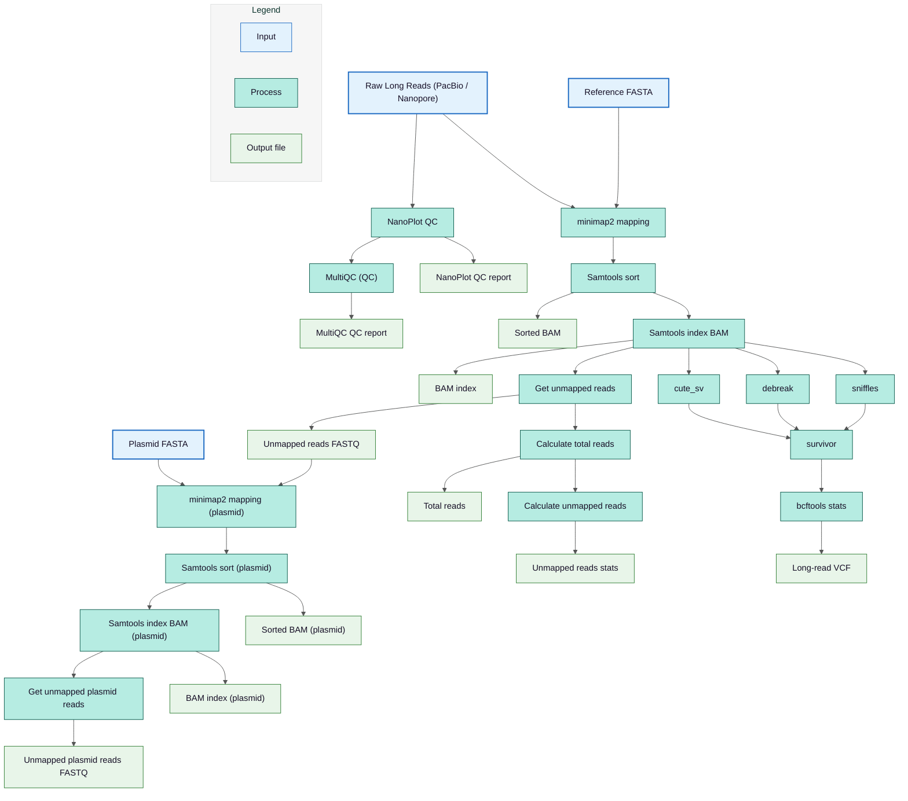
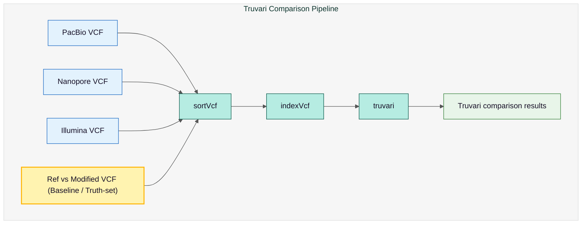

# EFSA Pipeline

## Table of Contents
- [Docker Container](#docker-container)
- [Input Validation](#input-validation)
- [Nextflow](#nextflow)
   - [Running the Pipeline](#running-the-pipeline)
   - [🔄 Pipeline Runtime Messages & Mapping Summary](#-pipeline-runtime-messages--mapping-summary)
      - [Runtime Status Messages](#runtime-status-messages)
      - [📊 Unmapped Reads Statistics](#-unmapped-reads-statistics)
      - [✅ Pipeline Execution Summary](#-pipeline-execution-summary)
      - [Removal of Nextflow Work Directory](#removal-of-nextflow-work-directory)
   - [📁 `data/valid` Directory Structure](#-datavalid-directory-structure)
   - [📁 `data/outputs` Directory Structure](#-dataoutputs-directory-structure)
      - [`fasta_ref_mod/`](#fasta_ref_mod)
      - [`illumina/`](#illumina)
      - [`pacbio/ and ont/`](#pacbio-and-ont)
      - [`truvari/`](#truvari)
      - [`unmapped_stats/`](#unmapped_stats)
  - [Graphical Representation of the Pipeline](#graphical-representation-of-the-pipeline)
      


# Docker Container

## Docker Setup for Users

This guide shows you how to run the EFSA Pipeline in a Docker container with access to input/output folders.

## Prerequisites

- Docker installed on your system
- Git (if cloning the repository)

## Quick Start

### Option 1: Using the Run Script (Recommended)

1. Make sure the script is executable:
   ```bash
   chmod +x run_container.sh
   ```

2. Run the container:
   ```bash
   ./run_container.sh
   ```

3. You'll be dropped into the container shell where you can run CLI commands
4. Type `exit` when done to return to your host system


### Option 2: Manual Docker Commands

1. Build the image:
   ```bash
   docker build -t efsa-pipeline .
   ```

2. Run interactively:
   ```bash
   docker run --privileged -d --rm \
    --network=host \
    -v /etc/ssl/certs:/etc/ssl/certs:ro \
    -v /usr/share/ca-certificates:/usr/share/ca-certificates:ro \
    --name efsa-pipeline-container \
    -w $(pwd) \
    -v "$(pwd)/data/inputs:/EFSA_workspace/data/inputs" \
    efsa-pipeline

   docker exec -it efsa-pipeline-container /bin/sh
   ```

# Input Validation

> **Important**
> 
> When container is build please follow the steps to preprocess the data with a validation package.
>

The input validation module preprocesses and verifies all input data to ensure it meets the required format and structure before the Nextflow pipeline is executed.

# Nextflow

Please run the `docker login` command that is given in the efsa Slack channel - Nextflow notes.

## Running the Pipeline

The main pipeline (`main.nf`) executes **all three workflows** in sequence.
Each workflow can also be executed individually if required.

---

### Running Main Workflow

This executes **short-read processing**, **long-read processing**, and **reference vs modified genome comparison** pipelines:

```bash
nextflow run main.nf \
  -process.containerOptions "-u $(id -u):$(id -g)" \
  --max_cpu $(nproc) \
  -resume
```


### Available Options

| Option         | Description                                  | Default                |
| -------------- | -------------------------------------------- | ---------------------- |
| `-resume`      | Resume pipeline from last successful process | –                      |
| `--in_dir`     | Input directory                              | `data/valid`           |
| `--out_dir`    | Output directory                             | `data/outputs`         |
| `--registry`   | Docker/Singularity container registry        | `ghcr.io/kate-simonova`|
| `--max_cpu`    | Maximum CPUs per process                     | `1`                    |
| `--log`        | Enable logging                               | `true`                 |
| `--clean_work` | Remove work directory after successful run   | `true`                 |
| `--help`       | Display help message                         | –                      |

---

### Running Individual Pipelines

You can also run each of the three sub-pipelines independently.

#### Short-read Processing

For Illumina short-read data:

```bash
nextflow run workflows/short-read-ref.nf \
  -process.containerOptions "-u $(id -u):$(id -g)" \
  --max_cpu $(nproc) \
  -resume
```

#### Long-read Processing

For Oxford Nanopore / PacBio long reads:

```bash
nextflow run workflows/long-read-ref.nf \
  -process.containerOptions "-u $(id -u):$(id -g)" \
  --max_cpu $(nproc) \
  -resume
```

#### Reference vs Modified Genome Comparison

For comparing reference and modified FASTA assemblies:

```bash
nextflow run workflows/fasta_ref_x_mod.nf \
  -process.containerOptions "-u $(id -u):$(id -g)" \
  --max_cpu $(nproc) \
  -resume
```


## 🔄 Pipeline Runtime Messages & Mapping Summary

During execution, the pipeline prints progress messages indicating which workflow is currently running and what type of reads are being processed.

### Runtime Status Messages

When the pipeline is running, you will see real-time messages like:

```text
ℹ️  Running pipeline: processing long-pacbio reads → mapping to the reference & modified fasta.

ℹ️  Running pipeline: processing long-ont reads → mapping to the reference & modified fasta.

ℹ️  Running pipeline: processing short reads → mapping to the reference & modified fasta.

ℹ️  Truvari: performing 3 comparisons.
```

These messages help track the execution order and confirm that all three pipelines are being executed as expected.

---

### 📊 Unmapped Reads Statistics

After mapping, the pipeline reports the number and percentage of **unmapped reads** for each analysis.
This is useful for assessing mapping efficiency and data quality.

#### Example Output

```text
📊 short-mod mapping:
    Unmapped reads: 19,880 (2.06%)
    Total input reads: 963,427

📊 short-ref mapping:
    Unmapped reads: 25,360 (2.63%)
    Total input reads: 963,362

📊 short-ref-plasmid mapping against plasmid:
    Unmapped reads: 4,677 (0.49%)
    Total input reads: 963,362

📊 ont/long-ref mapping:
    Unmapped reads: 52,745 (3.04%)
    Total input reads: 1,732,734

📊 ont/long-mod mapping:
    Unmapped reads: 48,145 (2.64%)
    Total input reads: 1,825,876

📊 pacbio/long-mod mapping:
    Unmapped reads: 41,596 (2.28%)
    Total input reads: 1,826,736

📊 pacbio/long-ref mapping:
    Unmapped reads: 47,472 (2.74%)
    Total input reads: 1,733,973
```

#### Interpretation

* **Unmapped reads** represent sequences that did not align to the provided reference or modified FASTA files.
* A low percentage of unmapped reads indicates:

  * High mapping quality
  * Good reference/assembly quality
  * Low contamination or sequencing errors

If the percentage of unmapped reads is unusually high, this may indicate:

* Poor read quality
* Inadequate or incomplete reference
* Contamination
* Incorrect input file selection


### ✅ Pipeline Execution Summary

The Nextflow pipelines ran successfully and produced the expected outputs. Each step completed without errors:

```text
✅ The reference to modified fasta comparision processing pipeline completed successfully.

✅ The long-ref processing pipeline completed successfully.

✅ The short-ref processing pipeline completed successfully.

✅ Truvari: the comparison of vcf files finished successfully.

✅ Execution of main.nf processing pipeline completed successfully.
```


### Removal of Nextflow Work Directory

When the pipeline is executed with the parameter:

```text
params.clean_work = true
```

Nextflow automatically removes the temporary `work/` directory after successful completion.

```text
ℹ️ Nextflow `work/` directory was removed.
```

**Notes:**

* The `work/` directory contains intermediate files and temporary outputs generated during pipeline execution.
* Removing it saves disk space while retaining all final results in the `out_dir`.
* If you want to keep intermediate files for debugging or inspection, set: `params.clean_work = false` in nextflow.config or use `--clean_work false` when running the pipeline.


## 📁 `data/valid` Directory Structure

This directory contains all input data used by the Nextflow pipeline.
```
data/valid/
├── assembled_genome.fasta
├── reference_genome.fasta
├── ref_plasmid.fa             # Reference plasmid sequences (if used)
├── mod_plasmid.fa             # Modified/assembled plasmid sequences (if used)
├── ref_feature.gff            # Genome annotation file GTF/GFF (if used)
│
├── illumina/                  
│   ├── SampleName_1.fastq.gz  
│   ├── SampleName_2.fastq.gz  
│
├── ont/                       
│   └── SampleName.fastq.gz
│
└── pacbio/                   
    └── SampleName.fastq.gz

```

| File / Folder            | Description                                           |
| ------------------------ | ----------------------------------------------------- |
| `reference_genome.fasta` | The primary reference genome sequence.                |
| `assembled_genome.fasta` | Assembled or modified genome for comparison/analysis. |
| `ref_plasmid.fa`         | Reference plasmid sequences.                          |
| `mod_plasmid.fa`         | Modified or assembled plasmid sequences.              |
| `ref_feature.gff`        | GFF feature file for annotations.                     |
| `illumina/`              | Paired-end Illumina short reads.                      |
| `ont/`                   | Oxford Nanopore long reads.                           |
| `pacbio/`                | PacBio long reads.                                    |


| Data Type       | Supported Extensions                   |
| --------------- | -------------------------------------- |
| FASTA sequences | `.fa`, `.fna`, `.fasta`                |
| GFF annotations | `.gff`, `.gtf`                         |
| FASTQ reads     | `.fastq`, `.fq`, `.fastq.gz`, `.fq.gz` |

## 📁 `data/outputs` Directory Structure

After successful pipeline execution, the outputs are organized as follows:

```
data/outputs
├── fasta_ref_mod       → Results from reference vs modified FASTA comparison
├── illumina            → Short-read (Illumina) mapping results
├── logs                → Pipeline logs and Nextflow reports
├── ont                 → Long-read (Oxford Nanopore) mapping results
├── pacbio              → Long-read (PacBio) mapping results
├── truvari             → Variant comparison results from Truvari
└── unmapped_stats      → Summary statistics of unmapped reads for each workflow

```

### `fasta_ref_mod/`


This folder contains results from the **reference vs modified FASTA comparison pipeline**:

```
fasta_ref_mod/
├── ref_x_mod.delta
├── ref_x_mod.filtered.coords
├── ref_x_mod_filtered.delta
└── ref_x_modsyri.vcf
```

**Description of files:**

* `ref_x_mod.delta`
  Raw alignment difference file between reference and modified FASTA (generated by `nucmer`/MUMmer).

* `ref_x_mod.filtered.coords`
  Filtered alignment coordinates showing high-confidence matches and structural differences.

* `ref_x_mod_filtered.delta`
  Cleaned and filtered delta file used for downstream structural comparison.

* `ref_x_modsyri.vcf`
  Structural variants and genome rearrangements detected by **SyRI**, stored in VCF format.


### `illumina/`

The flowchart below summarizes the pipeline for processing short reads. VCF annotation is performed only when a GFF/GTF annotation file is provided. Delly and Freebayes are run exclusively for reference genome mapping; these steps are skipped when reads are mapped to a modified genome or a plasmid.


This folder contains the full output of the **Illumina short-read processing pipeline**, including read quality control, trimming, genome mapping, and variant analysis.

```
data/outputs/illumina/
├── qc_trimming
│   ├── fastqc_out
│   ├── multiqc
│   └── trimmed_reads
├── short-mod
│   ├── bam
│   ├── bwa_index
│   ├── multiqc
│   ├── picard
│   ├── samtools_stats
│   └── unmapped
├── short-ref
│   ├── bam
│   ├── bcftools_stats
│   ├── bwa_index
│   ├── multiqc
│   ├── picard
│   ├── samtools_index_dict
│   ├── samtools_stats
│   ├── unmapped
│   └── vcf
└── short-ref-plasmid
    ├── bam
    ├── bwa_index
    ├── multiqc
    ├── picard
    ├── samtools_stats
    └── unmapped
```

#### Subfolder Structure

#### `qc_trimming/`

This directory contains all quality control and preprocessing outputs generated from raw Illumina reads.

* `fastqc_out/`
  Raw read quality reports (per-sample) generated by **FastQC**.

* `multiqc/`
  Aggregated quality control report summarizing all FastQC results.

* `trimmed_reads/`
  Quality-filtered and adapter-trimmed reads used for downstream mapping.

---

#### `short-ref/`

This folder contains Illumina reads mapped to the **reference genome**.

Includes:

* `bam/` — Sorted and indexed BAM alignment files (& SAM)
* `bwa_index/` — Precomputed BWA reference genome indices
* `samtools_index_dict/` — FASTA index and sequence dictionary files
* `samtools_stats/` — Alignment and coverage statistics
* `picard/` — Alignment QC metrics
* `bcftools_stats/` — Variant calling summary statistics
* `vcf/` — Variant calls generated by Delly and FreeBayes
* `multiqc/` — Combined QC report from mapping and alignment metrics
* `unmapped/` — fastq file with reads that failed to align to the reference genome

---

#### `short-ref-plasmid/`

This folder contains mapping results of Illumina reads against the **reference plasmid sequence**.

Includes:

* `bam/` — Aligned reads mapped to the plasmid
* `bwa_index/` — Plasmid reference index files
* `samtools_stats/` — Mapping statistics
* `picard/` — Alignment QC metrics
* `multiqc/` — Summary report
* `unmapped/` — Reads not mapping to the plasmid and not mapped to the reference genome

This folder allows evaluation of plasmid presence and coverage independently of the main genome.

---

#### `short-mod/`

Contains Illumina read alignments against the **modified/assembled genome**.

Includes:

* `bam/` — Sorted BAM files for modified genome mapping
* `bwa_index/` — Modified genome BWA index
* `samtools_stats/` — Mapping and coverage statistics
* `picard/` — Alignment QC metrics
* `multiqc/` — Combined reports
* `unmapped/` — Reads that failed to align to the modified genome

### `pacbio/` and `ont/`

This workflow shows the processing of raw long-read sequencing data (PacBio or Nanopore) from quality control to mapping. Reads undergo NanoPlot QC, then mapped to the reference or modified genome with minimap2, followed by sorting, indexing, and calculation of unmapped reads. Structural variant calling using cute_sv, debreak, and sniffles is performed only for reads mapped to the reference genome, and results are merged with SURVIVOR and summarized with bcftools stats, producing the final long-read VCF. Reads mapped to modified or plasmid sequences skip structural variant calling.



These two folders contain the complete results from the **long-read analysis pipeline** using:

* **PacBio** reads OR
* **Oxford Nanopore Technologies (ONT)** reads

Both follow the **same folder structure** and processing logic.

```
data/outputs/ont/
data/outputs/pacbio/
├── long-mod
│   ├── bam
│   ├── minimap2
│   └── unmapped
├── long-ref
│   ├── bam
│   ├── bcftools_stats
│   ├── cutesv_out
│   ├── debreak_out
│   ├── minimap2
│   ├── sniffles_out
│   ├── survivor_out
│   └── unmapped
├── long-ref-plasmid
│   ├── bam
│   ├── minimap2
│   └── unmapped
└── nanoplot
    └── SampleName_report
```


#### `long-ref/`

Contains all outputs generated by mapping long reads to the **reference genome**.

Includes:

* `bam/`
  Sorted and indexed **BAM alignment files** of long reads mapped to the reference genome.

* `minimap2/`
  Mapping logs, alignment summaries, and statistics produced during mapping with **minimap2**.

* `bcftools_stats/`
  Summary statistics of detected variants after variant calling.

* `cutesv_out/`
  Structural variants called using **cuteSV**.

* `sniffles_out/`
  Structural variants called using **Sniffles**.

* `debreak_out/`
  Structural variants detected using **DeBreak**.

* `survivor_out/`
  Merged structural variant callsets generated by **SURVIVOR**.

* `unmapped/`
  Long reads that failed to align to the reference genome.

---

#### `long-ref-plasmid/`

Contains mapping results of long reads against the **reference plasmid sequence**.

Includes:

* `bam/` — Plasmid-mapped long-read alignments
* `minimap2/` — Mapping logs and stats
* `unmapped/` — Reads that did not map to the plasmid


---

#### `long-mod/`

Contains alignments of long reads mapped to the **modified/assembled genome**.

Includes:

* `bam/` — Sorted alignment files
* `minimap2/` — Mapping outputs and statistics
* `unmapped/` — Reads that failed to align to the modified genome

This enables comparison between mapping reads on reference vs modified assemblies.

---

#### `nanoplot/`

Contains long-read quality control and summary statistics generated using **NanoPlot**.

Example content:

* `SampleName_report/`

Inside this folder you typically find:

* Read length distributions
* N50 / N90 statistics
* Quality score profiles
* Read length vs quality plots
* Summary statistics of long-read sequencing quality

Sure — here is the **final README-ready section** with both the **folder structure** and the **clear description of results** for `truvari` and `unmapped_stats`, without changing your original names.

---

Sure — here is your **Truvari section rewritten using `SampleName` placeholders**, so it’s generic, reusable, and clean for public documentation.

---

### `truvari/`

The flowchart illustrates the Truvari comparison pipeline for structural variant (SV) analysis. The Ref vs Modified VCF serves as the baseline or truth-set, against which VCFs from PacBio, Nanopore, and Illumina sequencing are compared. The pipeline begins with sorting the VCF files (sortVcf), indexing them (indexVcf), and then performing the Truvari comparison to generate the final comparison results.



#### Folder Structure

```
truvari
├── SampleName_sv_short_read.vcf.gz
├── SampleName_sv_short_read.vcf.gz.csi
├── SampleName.pacbio_sv_long_read.vcf.gz
├── SampleName.pacbio_sv_long_read.vcf.gz.csi
├── SampleName.ont_sv_long_read.vcf.gz
├── SampleName.ont_sv_long_read.vcf.gz.csi
├── ref_x_modsyri.vcf.gz
├── ref_x_modsyri.vcf.gz.csi
├── ref_x_modsyri_SampleName_sv_short_read_truvari
├── ref_x_modsyri_SampleName.pacbio_sv_long_read_truvari
└── ref_x_modsyri_SampleName.ont_sv_long_read_truvari
```

---

#### Description

This folder contains all structural variant (SV) callsets and their **Truvari benchmarking results** comparing SVs detected from sequencing data with the structural variants derived from the **reference vs modified genome comparison (SyRI)**.

---

#### Reference SV Callsets

* `ref_x_modsyri.vcf.gz`
  Structural variants derived from comparing the **reference genome** and the **modified genome** using **SyRI**.

* `SampleName_sv_short_read.vcf.gz`
  Structural variants detected from **Illumina short reads**.

* `SampleName.pacbio_sv_long_read.vcf.gz`
  Structural variants detected from **PacBio long reads**.

* `SampleName.ont_sv_long_read.vcf.gz`
  Structural variants detected from **Oxford Nanopore long reads**.

All `.csi` files represent index files for fast querying of VCF contents.

---

### Truvari Comparison Result Folders


Each Truvari output directory contains benchmarking results comparing the **SyRI structural variants** against sequencing-based SV calls:

* `ref_x_modsyri_SampleName_sv_short_read_truvari/`
  Comparison between SyRI SVs and SVs called from **Illumina short reads**.

* `ref_x_modsyri_SampleName.pacbio_sv_long_read_truvari/`
  Comparison between SyRI SVs and SVs called from **PacBio long reads**.

* `ref_x_modsyri_SampleName.ont_sv_long_read_truvari/`
  Comparison between SyRI SVs and SVs called from **Oxford Nanopore long reads**.

Each Truvari output folder usually contains:

* Matched SV calls
* Unmatched (false negative / false positive) calls
* Precision, recall, and F1 scores
* Comparison summary statistics


### `unmapped_stats/`

#### Folder Structure

```
unmapped_stats
├── SampleName_short_read_stats.txt
├── SampleName_pacbio_read_stats.txt
└── SampleName_ont_read_stats.txt
```

---

#### Description

This folder contains read mapping comparisons between the reference genome and the modified/assembled genome.
It helps evaluate how many reads map consistently to both assemblies and how many show assembly-specific behavior.

Each file summarizes:

* Reads mapping to both reference and modified assemblies
* Reads mapping only to reference
* Reads mapping only to modified
* Used to compare assembly quality and detect assembly-related differences

| File                               | Description                                                                                |
| ---------------------------------- | ------------------------------------------------------------------------------------------ |
| `SampleName_short_read_stats.txt`  | Mapping comparison of Illumina short reads between reference and modified assemblies       |
| `SampleName_pacbio_read_stats.txt` | Mapping comparison of PacBio long reads between reference and modified assemblies          |
| `SampleName_ont_read_stats.txt`    | Mapping comparison of Oxford Nanopore long reads between reference and modified assemblies |


Each report includes:

* Total input reads
* Number of unmapped reads
* Percentage of unmapped reads
* Mapping target (reference or modified genome)

### File Content 

Each mapping statistics (`SampleName_short_read_stats.txt`) file includes:
```
Pair IDs: <sample> reference vs <sample> modified
Intersected Reads: <number>
Unique Reads <sample> reference: <number>
Unique Reads <sample> modified: <number>
```

Here’s a clean, README-ready **description for the `logs/` folder**:

---
Thanks! Based on the exact contents you shared, here’s a **detailed description for the `logs/` folder** that you can use in your README:

---

### `logs/` — Nextflow Command and Log Files

#### Folder Contents

```
logs/
├── .command.begin    # Timestamp file marking the start of a process
├── .command.err      # Captures standard error output from the process
├── .command.log      # Logs process execution messages from Nextflow
├── .command.out      # Captures standard output from the process
├── .command.run      # Execution metadata (exit status, runtime, resources)
└── .command.sh       # The shell script containing the exact commands executed
```

#### Description

The `logs/` folder contains **detailed logs and command scripts** for each Nextflow process.

* **`.command.begin`** — Marks the start time of a process.
* **`.command.err`** — Captures standard error messages generated by the process.
* **`.command.log`** — General execution logs from Nextflow for the process.
* **`.command.out`** — Captures standard output of the process.
* **`.command.run`** — Metadata about process execution (e.g., exit code, runtime, resource usage).
* **`.command.sh`** — The shell script that Nextflow runs; contains the exact commands for the process.

## Graphical Representation of the Pipeline

