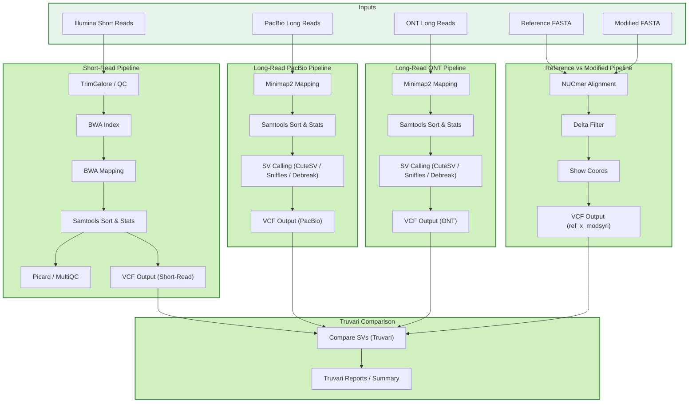

# Graphical Representation of the Pipeline

## High-Level Overview

## Detailed Workflow Diagrams

For detailed workflow diagrams of specific pipeline components, see the **[Outputs Documentation](../outputs/)** section:

- [Reference vs Modified FASTA Comparison](../outputs/fasta-ref-mod.md)
- [Illumina Short-Read Pipeline](../outputs/illumina.md)
- [Long-Read Pipeline (PacBio & ONT)](../outputs/long-reads.md)
- [Truvari Comparison Pipeline](../outputs/truvari.md)

## See Also

- [Running the Pipeline](running-pipeline.md) - Execution commands
- [Directory Structures](directory-structures.md) - Input/output organization
