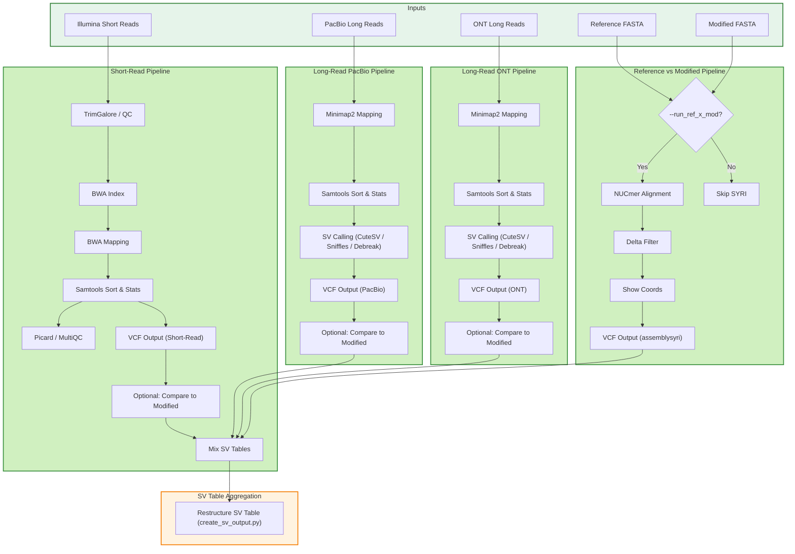

# Graphical Representation of the Pipeline

## High-Level Overview

```mermaid
flowchart TD
    %% Inputs
    subgraph Inputs
        illumina["Illumina Short Reads"]
        pacbio["PacBio Long Reads"]
        ont["ONT Long Reads"]
        ref_fasta["Reference FASTA"]
        mod_fasta["Modified FASTA"]
    end
    style Inputs fill:#E6F4EA,stroke:#2E7D32,stroke-width:2px

    %% Short-read pipeline
    subgraph ShortReadPipeline["Short-Read Pipeline"]
        illumina --> trimgalore["TrimGalore / QC"]
        trimgalore --> bwa_index["BWA Index"]
        bwa_index --> bwa_map["BWA Mapping"]
        bwa_map --> samtools_sort["Samtools Sort & Stats"]
        samtools_sort --> picard["Picard / MultiQC"]
        samtools_sort --> sr_vcf["VCF Output (Short-Read)"]
        sr_vcf --> short_mod["Optional: Compare to Modified"]
        short_mod --> agg_tbl
    end
    style ShortReadPipeline fill:#D0F0C0,stroke:#388E3C,stroke-width:2px

    %% Long-read PacBio pipeline
    subgraph LongReadPacBio["Long-Read PacBio Pipeline"]
        pacbio --> minimap2_pb["Minimap2 Mapping"]
        minimap2_pb --> samtools_sort_pb["Samtools Sort & Stats"]
        samtools_sort_pb --> pb_sv["SV Calling (CuteSV / Sniffles / Debreak)"]
        pb_sv --> pb_vcf["VCF Output (PacBio)"]
        pb_vcf --> long_mod_pb["Optional: Compare to Modified"]
        long_mod_pb --> agg_tbl
    end
    style LongReadPacBio fill:#D0F0C0,stroke:#388E3C,stroke-width:2px

    %% Long-read ONT pipeline
    subgraph LongReadONT["Long-Read ONT Pipeline"]
        ont --> minimap2_ont["Minimap2 Mapping"]
        minimap2_ont --> samtools_sort_ont["Samtools Sort & Stats"]
        samtools_sort_ont --> ont_sv["SV Calling (CuteSV / Sniffles / Debreak)"]
        ont_sv --> ont_vcf["VCF Output (ONT)"]
        ont_vcf --> long_mod_ont["Optional: Compare to Modified"]
        long_mod_ont --> agg_tbl
    end
    style LongReadONT fill:#D0F0C0,stroke:#388E3C,stroke-width:2px

    %% Reference vs Modified pipeline
    subgraph RefVsMod["Reference vs Modified Pipeline"]
        ref_fasta --> run_ref_x_mod_decision{"--run_ref_x_mod?"}
        mod_fasta --> run_ref_x_mod_decision
        run_ref_x_mod_decision -->|Yes| nucmer["NUCmer Alignment"]
        run_ref_x_mod_decision -->|No| skip_syri["Skip SYRI"]
        nucmer --> delta_filter["Delta Filter"]
        delta_filter --> show_coords["Show Coords"]
        show_coords --> syri_vcf["VCF Output (assemblysyri)"]
        syri_vcf --> agg_tbl
    end
    style RefVsMod fill:#D0F0C0,stroke:#388E3C,stroke-width:2px

    %% SV table aggregation (central)
    subgraph SVTable["SV Table Aggregation"]
        agg_tbl["Mix SV Tables"] --> restructure["Restructure SV Table (create_sv_output.py)"]
    end
    style SVTable fill:#FFF3E0,stroke:#F57C00,stroke-width:2px
```

## Detailed Workflow Diagrams

For detailed workflow diagrams of specific pipeline components, see the **[Output Documentation](../outputs/index.md)**:

- [Reference vs Modified FASTA Comparison with SyRI](../outputs/fasta-ref-mod.md)
- [Short-Read Processing Pipeline (Illumina)](../outputs/illumina.md)
- [Long-Read Processing Pipeline (PacBio & Oxford Nanopore)](../outputs/long-reads.md)

## See Also

- [Running the Pipeline](running-pipeline.md) - Execution commands
- [Directory Structures](directory-structures.md) - Input/output organization
