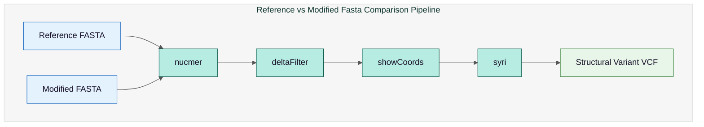

# Reference vs Modified FASTA Comparison Pipeline Output

## Pipeline Workflow



## Directory Structure

This folder contains results from the **reference vs modified FASTA comparison pipeline**:

```
fasta_ref_mod/
├── ref_x_mod.delta
├── ref_x_mod.filtered.coords
├── ref_x_mod_filtered.delta
└── ref_x_modsyri.vcf
```

## Output Files

### `ref_x_mod.delta`
Raw alignment difference file between reference and modified FASTA (generated by `nucmer`/MUMmer).

### `ref_x_mod.filtered.coords`
Filtered alignment coordinates showing high-confidence matches and structural differences.

### `ref_x_mod_filtered.delta`
Cleaned and filtered delta file used for downstream structural comparison.

### `ref_x_modsyri.vcf`
Structural variants and genome rearrangements detected by **SyRI**, stored in VCF format.

## Tools Used

The table below summarises all tools used within the pipeline:

| **Tool**        | **Link for Further Information**                       |
| --------------- | ------------------------------------------------------ |
| **Nucmer**      | [MUMmer](https://mummer4.github.io/manual/manual.html) |
| **deltaFilter** | [MUMmer](https://mummer4.github.io/manual/manual.html) |
| **showCoords**  | [MUMmer](https://mummer4.github.io/manual/manual.html) |
| **Syri**        | [SyRI GitHub](https://schneebergerlab.github.io/syri/) |


## Citation

* Goel, M., Sun, H., Jiao, W. et al. SyRI: finding genomic rearrangements and local sequence differences from whole-genome assemblies. Genome Biol 20, 277 (2019) doi:10.1186/s13059-019-1911-0

* Marçais G, Delcher AL, Phillippy AM, Coston R, Salzberg SL, Zimin A. MUMmer4: A fast and versatile genome alignment system. PLoS computational biology. 2018 Jan 26;14(1):e1005944.

## See Also

- [Truvari Comparison](truvari.md) - How these variants are compared with sequencing-based calls
- [Directory Structures](../nextflow/directory-structures.md) - Complete output organization
