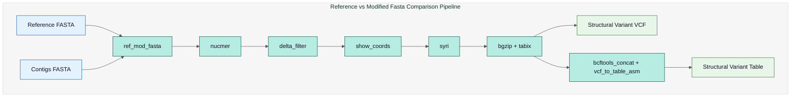

# Reference vs Modified FASTA Comparison Pipeline Output

## Pipeline Workflow


```mermaid
%%{init: {
  "theme": "base",
  "themeVariables": {
    "primaryColor": "#B6ECE2",
    "primaryTextColor": "#160F26",
    "primaryBorderColor": "#065647",
    "lineColor": "#545555",
    "clusterBkg": "#BABCBD22",
    "clusterBorder": "#DDDEDE",
    "fontFamily": "arial"
  }
}}%%
flowchart TB

%% ===== REF_X_MOD PIPELINE =====
subgraph REF_X_MOD["Reference vs Modified Fasta Comparison Pipeline"]

    %% Inputs
    REF_FASTA["Reference FASTA"]:::input
    CONTIGS["Contigs FASTA"]:::input

    %% Combine ref + contigs
    REF_MOD_COMB["ref_mod_fasta"]:::process

    %% Processes
    NUCMER["nucmer"]:::process
    DELTA["delta_filter"]:::process
    SHOWCOORDS["show_coords"]:::process
    SYRI["syri"]:::process
    BGZIP["bgzip + tabix"]:::process
    CONCAT_TABLE["bcftools_concat + vcf_to_table_asm"]:::process

    %% Outputs
    VCF_OUT["Structural Variant VCF"]:::output
    SV_TABLE["Structural Variant Table"]:::output

    %% Connections
    REF_FASTA --> REF_MOD_COMB
    CONTIGS --> REF_MOD_COMB
    REF_MOD_COMB --> NUCMER
    NUCMER --> DELTA --> SHOWCOORDS --> SYRI --> BGZIP --> VCF_OUT
    BGZIP --> CONCAT_TABLE --> SV_TABLE

end

%% ===== STYLING =====
classDef input fill:#E3F2FD,stroke:#1565C0
classDef process fill:#B6ECE2,stroke:#065647
classDef output fill:#E8F5E9,stroke:#2E7D32
```

## Directory Structure

> **Important!**
> To allow the pipeline to run, set `--run_syri` to `true` when launching the pipeline, or enable it in the `nextflow.config` file under the `params` section:
>
> ```groovy
> params {
>     run_syri = true
> }
> ```
>
> By default, this parameter is set to `true`.

This folder contains results from the **reference vs modified FASTA comparison pipeline**:

```
fasta_ref_mod/
├── assembly.delta
├── assembly.filtered.coords
├── assembly_concat.vcf
├── assembly_filtered.delta
├── assemblysyri.vcf
├── mod_contig_0
│   ├── mod_contig_0.delta
│   ├── mod_contig_0.filtered.coords
│   ├── mod_contig_0.vcf.gz
│   ├── mod_contig_0.vcf.gz.tbi
│   └── mod_contig_0_filtered.delta
└── mod_contig_0syri.vcf
```

## Output Files

All output files are generated only if --run_syri is set to true.

### `assembly.delta`
Raw alignment difference file between reference and modified FASTA (generated by `nucmer`/MUMmer).

### `assembly.filtered.coords`
Filtered alignment coordinates showing high-confidence matches and structural differences.

### `assembly_filtered.delta`
Cleaned and filtered delta file used for downstream structural comparison.

### `assemblysyri.vcf`
Structural variants and genome rearrangements detected by **SyRI**, stored in VCF format.

### mod_contig_[0..4]`
The folder contains syri comparison from each contig when assembly is fragmented into more than one contig. mod_contig_0.

### mod_contig_[0..4].vcf.gz`
A bgzipped VCF files of structural variants per contig.

### mod_contig_[0..4].vcf.gz.tbi`
Tabix index of a bgzipped VCF file used for efficient concatenation with bcftools.

## Tools Used

The table below summarises all tools used within the pipeline:

| **Tool**         | **Link for Further Information**                       |
| ---------------  | ------------------------------------------------------ |
| **Nucmer**       | [MUMmer](https://mummer4.github.io/manual/manual.html) |
| **delta_filter** | [MUMmer](https://mummer4.github.io/manual/manual.html) |
| **show_coords**  | [MUMmer](https://mummer4.github.io/manual/manual.html) |
| **Syri**         | [SyRI GitHub](https://schneebergerlab.github.io/syri/) |


## Citation

* Goel, M., Sun, H., Jiao, W. et al. SyRI: finding genomic rearrangements and local sequence differences from whole-genome assemblies. Genome Biol 20, 277 (2019) doi:10.1186/s13059-019-1911-0

* Marçais G, Delcher AL, Phillippy AM, Coston R, Salzberg SL, Zimin A. MUMmer4: A fast and versatile genome alignment system. PLoS computational biology. 2018 Jan 26;14(1):e1005944.

## See Also

- [Truvari Comparison](truvari.md) - How these variants are compared with sequencing-based calls
- [Directory Structures](../nextflow/directory-structures.md) - Complete output organization
