# Short-Read Processing Pipeline Output

## Pipeline Workflow

The flowchart below summarizes the pipeline for processing short reads. VCF annotation is performed only when a GFF/GTF annotation file is provided. Delly and Freebayes are run exclusively for reference genome mapping; these steps are skipped when reads are mapped to a modified genome or a plasmid.

```mermaid
%%{init: {
  "theme": "base",
  "themeVariables": {
    "primaryColor": "#B6ECE2",
    "primaryTextColor": "#160F26",
    "primaryBorderColor": "#065647",
    "lineColor": "#545555",
    "clusterBkg": "#BABCBD22",
    "clusterBorder": "#DDDEDE",
    "fontFamily": "arial"
  }
}}%%
flowchart TB

%% ===== INPUTS =====
RAW["Raw Illumina Reads"]
REF["Reference FASTA"]
PLASMID_REF["Plasmid FASTA"]
GFF["GFF / GTF Annotation"]
CONFIG["SnpEff Config"]

style RAW fill:#E3F2FD,stroke:#1565C0,stroke-width:2px
style REF fill:#E3F2FD,stroke:#1565C0,stroke-width:2px
style PLASMID_REF fill:#E3F2FD,stroke:#1565C0,stroke-width:2px
style GFF fill:#E3F2FD,stroke:#1565C0,stroke-width:2px
style CONFIG fill:#E3F2FD,stroke:#1565C0,stroke-width:2px

%% ===== QC =====
TRIM["TrimGalore"]
FASTQC["FastQC"]
MULTIQC_QC["MultiQC (QC)"]

RAW --> TRIM --> FASTQC --> MULTIQC_QC

%% ===== QC OUTPUTS =====
TRIMMED["Trimmed FASTQ"]:::output
FASTQC_OUT["FastQC report"]:::output
MULTIQC_QC_OUT["MultiQC QC report"]:::output

TRIM --> TRIMMED
FASTQC --> FASTQC_OUT
MULTIQC_QC --> MULTIQC_QC_OUT

%% ===== SHORT REF PIPELINE =====
BWA_INDEX["BWA index"]
BWA["BWA mapping"]
SORT["Samtools sort"]
STATS["Samtools stats"]
BAM_IDX["BAM index"]
PICARD["Picard metrics"]
FREEBAYES["Freebayes variant calling"]
BCFTOOLS["BCFtools stats"]
BUILD_CFG["Build snpEff config"]
SNPEFF["snpEff annotation"]
GET_UNMAPPED["Get unmapped reads"]

REF --> BWA_INDEX --> BWA
TRIMMED --> BWA
BWA --> SORT --> SORTED_BAM["Sorted BAM"]:::output
SORT --> STATS --> STATS_OUT["Samtools stats"]:::output
SORT --> BAM_IDX --> BAM_INDEX_OUT["BAM index"]:::output

%% ===== SHORT REF SV PIPELINE (Delly) =====
DELLY["Delly (SV calling)"]
BCF2VCF["Convert BCF to VCF"]
BAM_IDX --> DELLY --> BCF2VCF --> SV_VCF["SV VCF"]:::output

BAM_IDX --> GET_UNMAPPED --> UNMAPPED_OUT["Unmapped reads FASTQ"]:::output

BAM_IDX --> FREEBAYES --> VCF_RAW["Raw VCF"]:::output
VCF_RAW --> BCFTOOLS --> BCF_STATS["BCFtools stats"]:::output
GFF --> BUILD_CFG --> SNPEFF
CONFIG --> BUILD_CFG
VCF_RAW --> SNPEFF --> VCF_ANNOT["Annotated VCF"]:::output

BAM_IDX --> PICARD --> PICARD_OUT["Picard metrics"]:::output


%% ===== PLASMID PIPELINE =====
PL_INDEX["BWA index"]
PL_BWA["BWA mapping"]
PL_SORT["Samtools sort"]
PL_STATS["Samtools stats"]
PL_BAM_IDX["BAM index"]
PL_PICARD["Picard metrics"]
GET_UNMAPPED_PL["Get unmapped reads plasmid"]

PLASMID_REF --> PL_INDEX --> PL_BWA
UNMAPPED_OUT --> PL_BWA
PL_BWA --> PL_SORT --> PL_SORTED_BAM["Sorted BAM (plasmid)"]:::output
PL_SORT --> PL_STATS --> PL_STATS_OUT["Samtools stats (plasmid)"]:::output
PL_SORT --> PL_BAM_IDX --> PL_BAM_INDEX_OUT["BAM index"]:::output
PL_BAM_IDX --> PL_PICARD --> PL_PICARD_OUT["Picard metrics (plasmid)"]:::output
PL_BAM_IDX --> GET_UNMAPPED_PL --> PL_UNMAPPED_OUT["Unmapped reads FASTQ (plasmid)"]:::output

%% ===== STYLING =====
classDef input fill:#E3F2FD,stroke:#1565C0
classDef process fill:#B6ECE2,stroke:#065647
classDef output fill:#E8F5E9,stroke:#2E7D32
class TRIMMED,FASTQC_OUT,MULTIQC_QC_OUT,SORTED_BAM,STATS_OUT,BAM_INDEX_OUT,PICARD_OUT,MULTIQC_MAP_OUT,UNMAPPED_OUT,VCF_RAW,BCF_STATS,VCF_ANNOT,SV_VCF,PL_SORTED_BAM,PL_STATS_OUT,PL_PICARD_OUT,PL_MULTIQC_OUT,PL_UNMAPPED_OUT output

%% ===== LEGEND =====
subgraph LEGEND["Legend"]
    L1["Input"]:::input
    L2["Process"]:::process
    L3["Output file"]:::output
end
```



## Directory Structure

This folder contains the full output of the **Illumina short-read processing pipeline**, including read quality control, trimming, genome mapping, and variant analysis.

```
data/outputs/illumina/
├── qc_trimming
│   ├── fastqc_out
│   ├── multiqc
│   └── trimmed_reads
├── short-mod
│   ├── bam
│   ├── bwa_index
│   ├── multiqc
│   ├── picard
│   ├── samtools_stats
│   └── unmapped_fastq
├── short-ref
│   ├── bam
│   ├── bcftools_stats
│   ├── bwa_index
│   ├── multiqc
│   ├── picard
│   ├── samtools_index_dict
│   ├── samtools_stats
│   ├── unmapped_fastq
│   └── vcf
└── short-ref-plasmid
    ├── bam
    ├── bwa_index
    ├── multiqc
    ├── picard
    ├── samtools_stats
    └── unmapped_fastq
```

## Output Subdirectories

### `qc_trimming/`

This directory contains all quality control and preprocessing outputs generated from raw Illumina reads.

- **`fastqc_out/`** - Raw read quality reports (per-sample) generated by **FastQC**.
- **`multiqc/`** - Aggregated quality control report summarizing all FastQC results and trimming reports.
- **`trimmed_reads/`** - Quality-filtered and adapter-trimmed reads used for downstream mapping.

### `short-ref/`

This folder contains Illumina reads mapped to the **reference genome**.

Includes:

- **`bam/`** - Sorted and indexed BAM alignment files
- **`bwa_index/`** - Precomputed BWA reference genome indices
- **`samtools_index_dict/`** - FASTA index and sequence dictionary files
- **`samtools_stats/`** - Alignment and coverage statistics
- **`picard/`** - Alignment QC metrics
- **`bcftools_stats/`** - Variant calling summary statistics
- **`vcf/`** - Variant calls generated by Delly (SVs) and FreeBayes (SNP and INDELs) and annotated VCF (SNP and INDELs), if gff or gtf files are present in `data/valid`
- **`multiqc/`** - Combined QC report from mapping and alignment metrics and variant calling metrics
- **`unmapped_fastq/`** - FASTQ file with reads that failed to align to the reference genome

### `short-ref-plasmid/`

This folder holds the mapping results of Illumina reads aligned to the reference plasmid fasta. It is created only if a reference plasmid is present in the `data/valid` folder. A folder with a similar structure, `short-mod-plasmid/`, is created if a modified plasmid is present within the `data/valid` folder.

Includes:

- **`bam/`** - Aligned reads (that were not mapped to the reference) mapped to the plasmid
- **`bwa_index/`** - Plasmid reference index files
- **`samtools_stats/`** - Mapping and coverage statistics
- **`picard/`** - Alignment QC metrics
- **`multiqc/`** - Summary report of mapping and alignment metrics
- **`unmapped_fastq/`** - Reads not mapped to the plasmid and not mapped to the reference genome

### `short-mod/`

This folder contains Illumina read alignments against the **modified/assembled genome**.

Includes:

- **`bam/`** - Sorted BAM files for modified genome mapping
- **`bwa_index/`** - Modified genome BWA index
- **`samtools_stats/`** - Mapping and coverage statistics
- **`picard/`** - Alignment QC metrics
- **`multiqc/`** - Summary report of mapping and alignment metrics
- **`unmapped_fastq/`** - FASTQ file containing reads that failed to align to the modified genome

## Tools Used

| **Tool**        | **Link for Further Information**                                     |
| --------------- | -------------------------------------------------------------------- |
| **Trim Galore** | [Trim Galore](https://github.com/FelixKrueger/TrimGalore)            |
| **FastQC**      | [FastQC](https://www.bioinformatics.babraham.ac.uk/projects/fastqc/) |
| **MultiQC**     | [MultiQC](https://multiqc.info/)                                     |
| **BWA**         | [BWA](http://bio-bwa.sourceforge.net/)                               |
| **Picard**      | [Picard](https://broadinstitute.github.io/picard/)                   |
| **Samtools**    | [Samtools](http://www.htslib.org/)                                   |
| **BCFtools**    | [BCFtools](http://www.htslib.org/)                                   |
| **FreeBayes**   | [FreeBayes](https://github.com/freebayes/freebayes)                  |
| **SnpEff**      | [SnpEff](http://snpeff.sourceforge.net/)                             |
| **Delly**       | [Delly](https://github.com/dellytools/delly)                         |


## See Also

- [Long-Read Processing Pipeline Output](long-reads.md) - PacBio and ONT results
- [Unmapped Statistics](unmapped-stats.md) - Detailed unmapped read analysis
- [Truvari Comparison](truvari.md) - Variant comparison results
