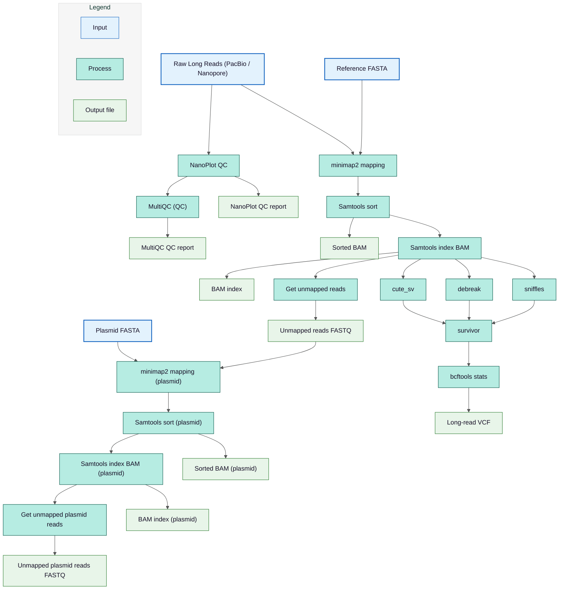

# Long-Read Peocessing Pipeline Output (PacBio & ONT)

## Pipeline Workflow

This workflow shows the processing of raw long-read sequencing data (PacBio or Nanopore) from quality control to mapping. Reads undergo NanoPlot QC, then mapped to the reference or modified genome with minimap2, followed by sorting, indexing, and calculation of unmapped reads. Structural variant calling using cute_sv, debreak, and sniffles is performed only for reads mapped to the reference genome, and results are merged with SURVIVOR and summarized with bcftools stats, producing the final long-read VCF. Reads mapped to modified or plasmid sequences skip structural variant calling.



## Overview

These two folders contain the complete results from the **long-read analysis pipeline** using:

- **PacBio** reads OR
- **Oxford Nanopore Technologies (ONT)** reads

Both follow the **same folder structure** and processing logic.

## Directory Structure

```
data/outputs/ont/
data/outputs/pacbio/
├── long-mod
│   ├── bam
│   └── unmapped_fastq
├── long-ref
│   ├── bam
│   ├── bcftools_stats
│   ├── cutesv_out
│   ├── debreak_out
│   ├── sniffles_out
│   ├── survivor_out
│   └── unmapped_fastq
├── long-ref-plasmid
│   ├── bam
│   └── unmapped_fastq
└── nanoplot
    └── SampleName_report
```

## Output Subdirectories

### `long-ref/`

Contains all outputs generated by mapping long reads to the **reference genome**.

Includes:

- **`bam/`** - Sorted and indexed **BAM alignment files** of long reads mapped to the reference genome.
- **`bcftools_stats/`** - Summary statistics of detected variants after variant calling.
- **`cutesv_out/`** - Structural variants called using **cuteSV**.
- **`sniffles_out/`** - Structural variants called using **Sniffles**.
- **`debreak_out/`** - Structural variants detected using **DeBreak**.
- **`survivor_out/`** - Merged structural variant callsets generated by **SURVIVOR**.
- **`unmapped_fastq/`** - Long reads that failed to align to the reference genome.

### `long-ref-plasmid/`

This folder holds the mapping results of long reads aligned to the reference plasmid sequence. It is created only if a reference plasmid is present in the `data/valid` folder. A folder with a similar structure, `long-mod-plasmid/`, is created if a modified plasmid is present within the `data/valid` folder.

Includes:

- **`bam/`** - Plasmid-mapped long-read alignments
- **`unmapped_fastq/`** - FASTQ file containing reads that did not map to the plasmid

### `long-mod/`

Contains alignments of long reads mapped to the **modified/assembled genome**.

Includes:

- **`bam/`** - Sorted alignment files
- **`unmapped_fastq/`** - Reads that failed to align to the modified genome

This enables comparison between mapping reads on reference vs modified assemblies.

### `nanoplot/`

Contains long-read quality control and summary statistics generated using **NanoPlot**.

Example content:

- `SampleName_report/`

Inside this folder you typically find:

- Read length distributions
- N50 / N90 statistics
- Quality score profiles
- Read length vs quality plots
- Summary statistics of long-read sequencing quality

## Tools Used

The table below summarises all tools used within the pipeline:

| **Tool**     | **Link for Further Information**                       |
| ------------ | ------------------------------------------------------ |
| **samtools** | [samtools](https://www.htslib.org/doc/samtools.html)   |
| **BCFtools** | [BCFtools](https://samtools.github.io/bcftools/)       |
| **cuteCV**   | [cuteCV](https://github.com/tjiangHIT/cuteSV?tab=readme-ov-file)             |
| **DeBreak**  | [DeBreak](https://github.com/Maggi-Chen/DeBreak)       |
| **Sniffles** | [Sniffles](https://github.com/fritzsedlazeck/Sniffles) |
| **SURVIVOR** | [SURVIVOR](https://github.com/fritzsedlazeck/SURVIVOR) |
| **NanoPlot** | [NanoPlot](https://github.com/wdecoster/NanoPlot)      |

## Citation

* Wouter De Coster, Rosa Rademakers, NanoPack2: population-scale evaluation of long-read sequencing data, Bioinformatics, Volume 39, Issue 5, May 2023, btad311, https://doi.org/10.1093/bioinformatics/btad311

* Twelve years of SAMtools and BCFtools
Petr Danecek, James K Bonfield, Jennifer Liddle, John Marshall, Valeriu Ohan, Martin O Pollard, Andrew Whitwham, Thomas Keane, Shane A McCarthy, Robert M Davies, Heng Li GigaScience, Volume 10, Issue 2, February 2021, giab008, https://doi.org/10.1093/gigascience/giab008

* Jiang T et al. Long-read-based human genomic structural variation detection with cuteSV. Genome Biol 21, 189 (2020). https://doi.org/10.1186/s13059-020-02107-y

* Transient structural variations have strong effects on quantitative traits and reproductive isolation in fission yeast.
Jeffares, Daniel C; Jolly, Clemency; Hoti, Mimoza; Speed, Doug; Shaw, Liam; Rallis, Charalampos; Balloux, Francois; Dessimoz, Christophe; Bähler, Jürg; Sedlazeck, Fritz J.
Nature communications, Vol. 8, 14061, 24.01.2017, p. 1-11. DOI:10.1038/NCOMMS14061

* Chen, Y., Wang, A.Y., Barkley, C.A. et al. Deciphering the exact breakpoints of structural variations using long sequencing reads with DeBreak. Nat Commun 14, 283 (2023). https://doi.org/10.1038/s41467-023-35996-1

* Smolka, M., Paulin, L.F., Grochowski, C.M. et al. Detection of mosaic and population-level structural variants with Sniffles2. Nat Biotechnol 42, 1571–1580 (2024). https://doi.org/10.1038/s41587-023-02024-y

* Sedlazeck, F.J., Rescheneder, P., Smolka, M. et al. Accurate detection of complex structural variations using single-molecule sequencing. Nat Methods 15, 461–468 (2018). https://doi.org/10.1038/s41592-018-0001-7


## See Also

- [Short-Read Processing Pipeline Output](illumina.md) - Short-read results
- [Unmapped Statistics](unmapped-stats.md) - Detailed unmapped read analysis
- [Truvari Comparison](truvari.md) - Variant comparison results
