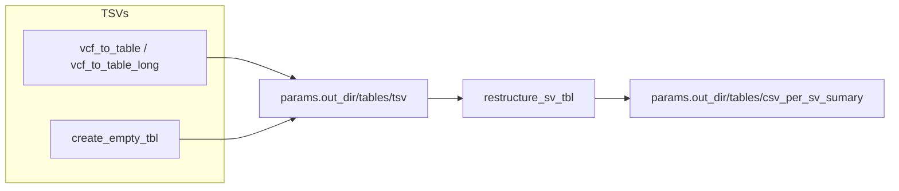

## Generation of per structural variation (SV) type CSV tables

These utilities convert SV VCFs into compact TSV summaries and then merge available summaries into per-SV-type CSV tables.



### Key points
- Variants are extracted into a table format with processes `vcf_to_table` and `vcf_to_table_long`
- if one of the pipelines was not running (shourt/long/assembly) an empty tsv file is generated with a process create_empty_tbl
- `restructure_sv_tbl` process: the merge step accepts any subset of (assembly, long_ont, long_pacbio, short) and ignores missing files.
- Long reads are handled as two separate sources: `long_ont` and `long_pacbio`. Output CSVs keep these in distinct `long_ont_*` and `long_pacbio_*` columns.
- Outputs overview:
```
data/outputs/tables/
├── csv_per_sv_summary
│   ├── Deletions.csv
│   ├── Insertions.csv
│   ├── Inversions.csv
│   ├── Replacements.csv
│   └── Translocations.csv
└── tsv
    ├── assembly_sv_summary.tsv
    ├── short_sv_summary.tsv
    ├── mab-pb_sv_summary.tsv
    └── map-ont_sv_summary.tsv
```

Example (local):
```bash
python3 modules/utils/create_sv_output.py --asm assembly_sv_summary.tsv \
  --long_ont sample1_ont_sv_summary.tsv --long_pacbio sample1_pacbio_sv_summary.tsv \
  --short sample1_short_sv_summary.tsv --out csv_per_sv_sumary
```


### Explanation of csv_per_sv_summary CSV columns

The final table of each CSV file has multiple columns.
Each row represents one structural variant (SV) event, with coordinates and evidence aggregated across assembly-based, long-read, and short-read pipelines.

**Column prefixes**

- **asm_** — values reported by the assembly-based SV pipeline
- **long_** — values reported by long-read pipelines (ONT or PacBio)
- **short_** — values reported by short-read pipelines


**Common event-level and pipeline-derived columns**

These columns describe the SV event independently of any specific pipeline:

| Column name         | Description                                                                                                                                |
| ------------------- | ------------------------------------------------------------------------------------------------------------------------------------------ |
| **event_id**        | Unique identifier of the structural variant (SV) event.                                                                                    |
| **chrom**           | Chromosome where the SV is located (VCF `CHROM`).                                                                                          |
| **std_svtype**      | Standardized SV type harmonized across pipelines (e.g. DEL, DUP, INS, INV).                                                                |
| **event_start**     | Representative start coordinate of the SV (VCF `POS`), selected from available pipeline calls.                                             |
| **event_end**       | Representative end coordinate of the SV (VCF `END`).                                                                                       |
| **event_length_bp** | Length of the SV in base pairs, calculated as `event_end − event_start`.                                                                   |
| **support_score**   | Integrated support score summarizing evidence across all pipelines, taking into account SV agreement, confidence scores, and read support. |

| **percentage_overlap**   | Percentage of genomic overlap between two structural variants, calculated as the length of the intersection of their genomic intervals divided by the length of the smaller variant, multiplied by 100. |

**Additional pipeline-specific columns**

These columns are present only for certain pipelines:

| Column name                          | Description                                                                                                                               |
| ------------------------------------ | ----------------------------------------------------------------------------------------------------------------------------------------- |
| **long_(ont|pacbio)_supporting_reads**        | Number of Oxford Nanopore / Pacbio reads supporting the structural variant (VCF `FORMAT` field `DR`) (SV).                                                                   |
| **long_(ont|pacbio)_supporting_methods**     | Number of variant callers (max 3 cute_cv, debreak, sniffles) reads supporting the structural variant (SV).                                                                            |
| **short_reads_copy_number_estimate** | Estimated copy number derived from short-read depth information (VCF `FORMAT` field `RDCN`). |
