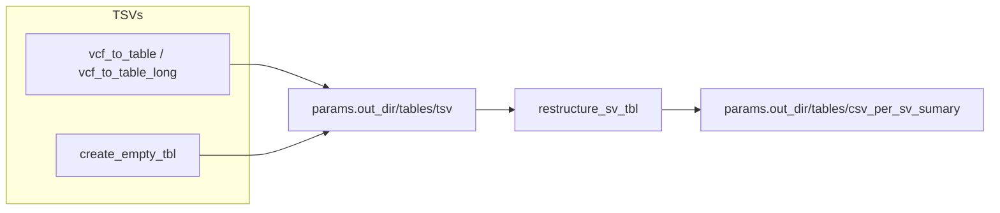

## Generation of per structural variation (SV) type CSV tables

These utilities convert SV VCFs into compact TSV summaries and then merge available summaries into per-SV-type CSV tables.



Key points:
- Variants are extracted into a table format with processes `vcf_to_table` and `vcf_to_table_long`
- if one of the pipelines was not running (shourt/long/assembly) an empty tsv file is generated with a process create_empty_tbl
- `restructure_sv_tbl` process: the merge step accepts any subset of (assembly, long_ont, long_pacbio, short) and ignores missing files.
- Long reads are handled as two separate sources: `long_ont` and `long_pacbio`. Output CSVs keep these in distinct `long_ont_*` and `long_pacbio_*` columns.
- Outputs overview:
```
data/outputs/tables/
├── csv_per_sv_summary
│   ├── Deletions.csv
│   ├── Insertions.csv
│   ├── Inversions.csv
│   ├── Replacements.csv
│   └── Translocations.csv
└── tsv
    ├── assembly_sv_summary.tsv
    ├── short_sv_summary.tsv
    ├── mab-pb_sv_summary.tsv
    └── map-ont_sv_summary.tsv
```

Example (local):
```bash
python3 modules/utils/create_sv_output_xlsx.py --asm assembly_sv_summary.tsv \
  --long_ont sample1_ont_sv_summary.tsv --long_pacbio sample1_pacbio_sv_summary.tsv \
  --short sample1_short_sv_summary.tsv --out csv_per_sv_sumary
```