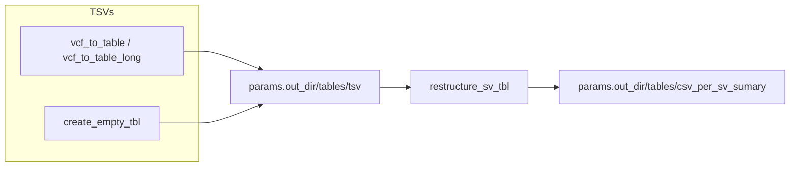

## Generation of per structural variation (SV) type CSV tables

These utilities convert SV VCFs into compact TSV summaries and then merge available summaries into per-SV-type CSV tables.


```mermaid
flowchart LR
  subgraph TSVs
    A[vcf_to_table / vcf_to_table_long]
    B[create_empty_tbl]
  end
  A --> C[params.out_dir/tables/tsv]
  B --> C
  C --> D[restructure_sv_tbl]
  D --> E[params.out_dir/tables/csv_per_sv_sumary]
```

### Key points

- By default a nextflow pipeline is collecting the tables from pipelines and runs restructure_sv_tbl to create all summary  
- Variants are extracted into a table format with processes `vcf_to_table` and `vcf_to_table_long`
- If one of the pipelines was not running (shourt/long/assembly) an empty tsv file is generated with a process create_empty_tbl
- `restructure_sv_tbl` process: the merge step accepts any subset of (assembly, long_ont, long_pacbio, short) and ignores missing files.
- Long reads are handled as two separate sources: `long_ont` and `long_pacbio`. Output CSVs keep these in distinct `long_ont_*` and `long_pacbio_*` columns.
- Final event rows are first built by clustering records within the same chromosome and standardized SV type, then a final pass adds `linked_event` entries for overlapping final SV rows on the same chromosome.
- `linked_event` is the only relationship column in the final CSVs. It includes both same-type and cross-type overlaps.

### VCF Extraction and Variant Type Handling

The pipeline extracts variants from VCF files using different fields depending on the source:

**Assembly (syri) variants:**
- **Variant type source:** VCF `ALT` field (e.g., DEL, DUP, INV, INS, TRANS, INVDP, CPG, CPL, SYN, etc.)
- **Extraction command:** `bcftools query -f '%CHROM\t%POS\t%INFO/END\t%ALT\t%ID\t%INFO/StartB\t%INFO/EndB\n'`
- **Columns extracted:** chrom, start (POS), end (INFO/END), svtype (ALT), info_svtype (ID), start_mod (InfoStartB), end_mod (EndB)

**Short-read (delly) variants:**
- **Variant type source:** VCF `INFO/SVTYPE` field (e.g., DEL, DUP, INV, INS, TRA)
- **Extraction command:** `bcftools query -f '%CHROM\t%POS\t%INFO/END\t%INFO/SVTYPE\t%INFO/CHR2\t%POS2\t%ALT\t%INFO/SVLEN\t%INFO/PE\t%QUAL\t[%RDCN]\n'`
- **Key feature:** Includes `svlen` directly from VCF for accurate insertion/translocation lengths

**Long-read (cuteSV/sniffles/debreak/SURVIVOR) variants:**
- **Variant type source:** VCF `ID` field or `SVTYPE` in INFO
- **Extraction command:** `bcftools query -f '%CHROM\t%POS\t%INFO/END\t%INFO/SVTYPE\t%ID\t%INFO/SVLEN\t[%DR{1}]\t%QUAL\t%INFO/SUPP\n'`
- **Supporting reads:** Extracted from FORMAT/DR (`DR{1}`) for long-read evidence
- **Supporting methods:** Populated from `INFO/SUPP` and stored in `long_(ont|pacbio)_supporting_methods`

### Variant Type Standardization

All extracted variant types are standardized to one of six categories in `create_sv_output.py`:

- `DEL` (Deletion)
- `DUP` (Duplication)
- `INS` (Insertion)
- `INV` (Inversion)
- `TRA` (Translocation) — includes TRANS, BND, CTX, and other inter-chromosomal variants
- `RPL` (Replacement/Other) — includes SUB, SNV, SYN, HDR, and unrecognized types

**Mapping strategy:**
1. Direct lookup in `INFO_MAP` for exact type matches
2. Token-based search for substring matches (e.g., "INVDP" contains "INV" → INV)
3. Assembly-specific prefix patterns for syri-specific types (e.g., CPG→INS, CPL→DEL, SYN→RPL)
4. All unmatched types default to `RPL` (replacement)

This ensures all 20+ syri variant types are correctly categorized and no variants are lost during processing.

---

```text
data/outputs/tables/
├── csv_per_sv_summary
│   ├── Deletions.csv
│   ├── Duplications.csv
│   ├── Insertions.csv
│   ├── Inversions.csv
│   ├── Replacements.csv
│   └── Translocations.csv
└── tsv
    ├── assembly_sv_summary.tsv
    ├── short_sv_summary.tsv
    ├── mab-pb_sv_summary.tsv
    └── map-ont_sv_summary.tsv
```

### Example command

```bash
python3 modules/utils/create_sv_output.py --asm assembly_sv_summary.tsv \
  --long_ont sample1_ont_sv_summary.tsv \
  --long_pacbio sample1_pacbio_sv_summary.tsv \
  --short sample1_short_sv_summary.tsv \
  --out csv_per_sv_sumary
```

### All supported processing script options

| Option | Description |
|---|---|
| `--asm` | TSV file containing structural variant summary from assembly-based calling. Optional. |
| `--long_ont` | TSV file containing structural variant summary from Oxford Nanopore long-read data. Optional. |
| `--long_pacbio` | TSV file containing structural variant summary from PacBio long-read data. Optional. |
| `--short` | TSV file containing structural variant summary from short-read sequencing data. Optional. |
| `--out` | Output directory for the per-SV CSV files. Required. |
| `--tol` | Within-type clustering tolerance in base pairs. Determines whether raw SV calls get merged into the same event. Default: `10`. |
| `--cross_type_tol` | Tolerance in base pairs for linking final events with near-identical coordinates in `linked_event`. Default: `0`, which keeps overlap-only linking. |

### Explanation of `csv_per_sv_summary` CSV columns

The final table in each CSV file contains one row per final structural variant (SV) event, with coordinates and evidence aggregated across assembly-based, long-read, and short-read pipelines.

**Column prefixes**

- **asm_** — values reported by the assembly-based SV pipeline
- **long_ont_** — values reported by the Oxford Nanopore long-read SV pipeline
- **long_pacbio_** — values reported by the PacBio long-read SV pipeline
- **short_** — values reported by the short-read SV pipeline

### Common event-level and pipeline-derived columns

| Column name | Description |
|---|---|
| **event_id** | Unique identifier of the final structural variant event, such as `DEL_1` or `DUP_2`. |
| **chrom** | Chromosome where the SV is located (VCF `CHROM`). |
| **std_svtype** | Standardized SV type harmonized across pipelines. Current values are `DEL`, `DUP`, `INS`, `RPL`, `INV`, and `TRA`. |
| **event_start** | **Most confident overlap start coordinate** of the clustered SV calls. Calculated as the maximum of all start coordinates across the cluster members. This represents the rightmost (most conservative) start position where all source pipelines agree.  |
| **event_end** | **Most confident overlap end coordinate** of the clustered SV calls. Calculated as the minimum of all end coordinates across the cluster members. This represents the leftmost (most conservative) end position where all source pipelines agree. |
| **event_length_bp** | **Length of the representative event region**, derived from `svlen` (preferred) or calculated from coordinates as fallback. All types (DEL, DUP, INS, RPL, INV, TRA) use `svlen` directly when available from the VCF. When `svlen` is missing: **Interval types (DEL, DUP, INV, RPL):** length derived from `event_end - event_start + 1`. **Point types (INS, TRA):** set to `0` (no interval). The `event_length_bp` column in the final row shows the minimum valid `svlen` across all source pipelines for that event. |
| **support_score** | Number of input sources contributing to the final event row. In the current implementation this is the count of non-empty calls among `asm`, `long_ont`, `long_pacbio`, and `short`. |
| **percentage_overlap** | Comma-separated overlap percentages collected during same-type event clustering. Each value is calculated during one clustering merge step as `(intersection length / longer interval length) × 100`. This field is empty when the final event was built from a single record only. |
| **linked_event** | Semicolon-separated list of overlapping final SV events on the same chromosome. This single column includes both same-type and cross-type links. Each linked entry has the format `<event_id> (<std_svtype>, <chrom>:<start>-<end>, <relation>)`. Standard relation values are `exact_coordinates`, `overlap`, `nested_in`, and `contains`, always from the point of view of the current row. If `--cross_type_tol` is set above `0`, near-identical boundaries may also be reported as `same_coordinates_within_<N>bp`. Leave empty when no linked events are found. |

### Possible values in `linked_event`

The examples below use simplified coordinates for clarity.

| Example current event | Example linked event entry | Meaning |
|---|---|---|
| `DEL_2` at `chr1:23-67` | `RPL_1 (RPL, chr1:23-67, exact_coordinates)` | The linked event has exactly the same coordinates as the current event. |
| `DEL_2` at `chr1:23-67` | `INV_1 (INV, chr1:10-90, nested_in)` | The current event is fully inside the linked event interval. |
| `RPL_1` at `chr1:10-90` | `DEL_2 (DEL, chr1:23-67, contains)` | The current event fully contains the linked event interval. |
| `DEL_2` at `chr1:23-67` | `DEL_3 (DEL, chr1:60-100, overlap)` | The two events partially overlap, but neither fully contains the other. |
| `DEL_2` at `chr1:23-67` with `--cross_type_tol 5` | `RPL_2 (RPL, chr1:25-69, same_coordinates_within_5bp)` | The events do not overlap exactly, but their start and end coordinates are both within the specified tolerance. |

### Additional pipeline-specific columns

| Column name | Description |
|---|---|
| **long_(ont\|pacbio)_supporting_reads** | Number of Oxford Nanopore or PacBio reads supporting the structural variant (VCF `FORMAT` field `DR`, when present). |
| **long_(ont\|pacbio)_supporting_methods** | Number or label of long-read variant calling methods supporting the structural variant, derived from the TSV summary when available. |
| **short_reads_copy_number_estimate** | Estimated copy number derived from short-read depth information (VCF `FORMAT` field `RDCN`). |

### Source-specific length columns and calculation strategy

#### Structural Variant Type Conventions by Data Source

**Short-read variants (delly):**
- `DEL`, `DUP`, `INV`: reported as real intervals with `start < end`
- `INS`: reported as a single position (`start == end`) representing the insertion point
- `TRA`: reported as a breakpoint (`start == end`) representing the breakpoint position
- For `INS` and `TRA`, the inserted/translocated sequence length is provided in the `svlen` field, not from coordinate difference

**Assembly variants (syri):**
- Syri uses the VCF `ALT` field for variant types: `DEL`, `INS`, `INV`, `DUP`, `TRANS` (translocation), `CPG` (copy gain), `CPL` (copy loss), `SYN` (syntenic), and alignment/inverted variants
- These are mapped to standardized types: `DEL`, `INS`, `INV`, `DUP`, `TRA`, `RPL` (replacements)
- Coordinates extracted as real intervals from VCF `POS` and `INFO/END` fields
- Breakpoint information available in `INFO/StartB` and `INFO/EndB` (stored as `asm_start_mod` and `asm_end_mod`)

**Long-read variants (cuteSV, sniffles, debreak, SURVIVOR merged):**
- Reported with `SVTYPE` in INFO field
- Handled similarly to short-read variants with clustering and best-record selection

#### Length Derivation Logic

The `create_sv_output.py` script handles `svlen` consistently across all sources:

1. **If `svlen` is provided in the input TSV/VCF**: Use it directly (most reliable representation of length)
2. **If `svlen` is missing**:
   - **For interval variants (DEL, DUP, INV, RPL):** Derive `svlen = end - start + 1`
   - **For point variants (INS, TRA):** Set `svlen = 0` (no interval, length is semantic information in the variant call)
   - **For unknown types**: Attempt coordinate-based derivation, fallback to `None`

This ensures accurate length reporting regardless of variant type and source pipeline.

#### Event Length Calculation for Final Rows

In the final CSV tables:
- **event_length_bp** is computed as the minimum valid `svlen` across all source records in the clustered event
- If no sources provide `svlen`, `event_length_bp` is `NaN`
- This conservative approach ensures reported lengths represent the smallest (most confident) size estimate

Each source pipeline registers its own length in the table:
- **asm_length** — Assembly pipeline svlen
- **long_ont_length** — Oxford Nanopore long-read svlen
- **long_pacbio_length** — PacBio long-read svlen
- **short_length** — Short-read svlen

---

### Assembly coordinates for translocations (asm_start_mod, asm_end_mod)

Two additional assembly-specific columns appear **only in Translocations.csv**:

- **asm_start_mod** — Start position of the translocation event in the modified (non-reference) genome
- **asm_end_mod** — End position of the translocation event in the modified (non-reference) genome

These columns are automatically removed from all non-translocation tables (Insertions, Deletions, Duplications, Replacements, Inversions) to maintain table clarity and avoid sparse empty columns.

**Rationale:** Translocations require two coordinate pairs to describe both breakpoint locations. The primary coordinates (`event_start`, `event_end`) mark the position in the reference genome (origin breakpoint), while these modifier coordinates mark the same event's position in the modified genome (destination breakpoint).

### Event coordinate computation workflow

The `create_sv_output.py` script processes SV records through the following steps:

1. **Load and standardize records** from all available source pipelines (assembly, long-read ONT/PacBio, short-read)

2. **Cluster records by (chromosome, standardized SV type)** using interval overlap with a tolerance window (`--tol`, default 10 bp). Records are considered part of the same event if:
   - They share the same chromosome and standardized SV type
   - Their intervals overlap (accounting for tolerance)
   - At least one of the breakpoints (start or end) is within tolerance between members

3. **Select best representative per source** within each cluster using a ranking strategy:
   - Rank 1: Supporting reads / evidence count (higher is better)
   - Rank 2: Quality score (higher is better)
   - Rank 3: SV size (larger is weighted negatively)
   
   This ensures the highest-confidence call from each source is carried forward.

4. **Calculate overlapping interval (event_start, event_end):**
   - `event_start = max(all member start coordinates)` — the rightmost (most conservative) start
   - `event_end = min(all member end coordinates)` — the leftmost (most conservative) end
   - This interval represents the consensus region where all cluster members agree

5. **Compute event_length_bp** based on SV type:
   - **INS:** `min(all non-null source svlen values)` — minimum reported insertion length
   - **Other types:** `event_end - event_start + 1` — length of consensus interval

6. **Assemble final row** with all source-specific fields, filtering unnecessary columns (e.g., removing `asm_start_mod/asm_end_mod` from deletions, removing internal type fields)

7. **Final pass: link overlapping events** by scanning all final rows on the same chromosome and recording any coordinate overlaps or near-overlaps (if `--cross_type_tol` is set)
