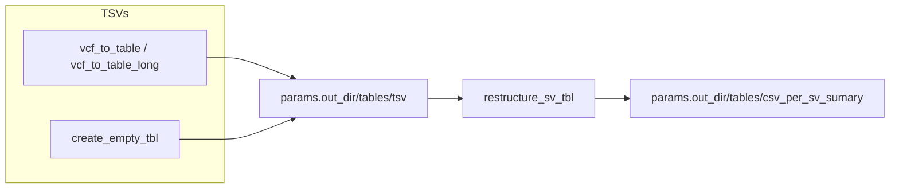

## Generation of per structural variation (SV) type CSV tables

These utilities convert SV VCFs into compact TSV summaries and then merge available summaries into per-SV-type CSV tables.


```mermaid
flowchart LR
  subgraph TSVs
    A[vcf_to_table / vcf_to_table_long]
    B[create_empty_tbl]
  end
  A --> C[params.out_dir/tables/tsv]
  B --> C
  C --> D[restructure_sv_tbl]
  D --> E[params.out_dir/tables/csv_per_sv_sumary]
```

### Key points

- By default a nextflow pipeline is collecting the tables from pipelines and runs restructure_sv_tbl to create all summary  
- Variants are extracted into a table format with processes `vcf_to_table` and `vcf_to_table_long`
- If one of the pipelines was not running (shourt/long/assembly) an empty tsv file is generated with a process create_empty_tbl
- `restructure_sv_tbl` process: the merge step accepts any subset of (assembly, long_ont, long_pacbio, short) and ignores missing files.
- Long reads are handled as two separate sources: `long_ont` and `long_pacbio`. Output CSVs keep these in distinct `long_ont_*` and `long_pacbio_*` columns.
- Final event rows are first built by clustering records within the same chromosome and standardized SV type, then a final pass adds `linked_event` entries for overlapping final SV rows on the same chromosome.
- `linked_event` is the only relationship column in the final CSVs. It includes both same-type and cross-type overlaps.

### Outputs overview

```text
data/outputs/tables/
├── csv_per_sv_summary
│   ├── Deletions.csv
│   ├── Insertions.csv
│   ├── Inversions.csv
│   ├── Replacements.csv
│   └── Translocations.csv
└── tsv
    ├── assembly_sv_summary.tsv
    ├── short_sv_summary.tsv
    ├── mab-pb_sv_summary.tsv
    └── map-ont_sv_summary.tsv
```

### Example command

```bash
python3 modules/utils/create_sv_output.py --asm assembly_sv_summary.tsv \
  --long_ont sample1_ont_sv_summary.tsv \
  --long_pacbio sample1_pacbio_sv_summary.tsv \
  --short sample1_short_sv_summary.tsv \
  --out csv_per_sv_sumary
```

### All supported processing script options

| Option | Description |
|---|---|
| `--asm` | TSV file containing structural variant summary from assembly-based calling. Optional. |
| `--long_ont` | TSV file containing structural variant summary from Oxford Nanopore long-read data. Optional. |
| `--long_pacbio` | TSV file containing structural variant summary from PacBio long-read data. Optional. |
| `--short` | TSV file containing structural variant summary from short-read sequencing data. Optional. |
| `--out` | Output directory for the per-SV CSV files. Required. |
| `--tol` | Within-type clustering tolerance in base pairs. Determines whether raw SV calls get merged into the same event. Default: `10`. |
| `--cross_type_tol` | Tolerance in base pairs for linking final events with near-identical coordinates in `linked_event`. Default: `0`, which keeps overlap-only linking. |

### Explanation of `csv_per_sv_summary` CSV columns

The final table in each CSV file contains one row per final structural variant (SV) event, with coordinates and evidence aggregated across assembly-based, long-read, and short-read pipelines.

**Column prefixes**

- **asm_** — values reported by the assembly-based SV pipeline
- **long_ont_** — values reported by the Oxford Nanopore long-read SV pipeline
- **long_pacbio_** — values reported by the PacBio long-read SV pipeline
- **short_** — values reported by the short-read SV pipeline

### Common event-level and pipeline-derived columns

| Column name | Description |
|---|---|
| **event_id** | Unique identifier of the final structural variant event, such as `DEL_1` or `RPL_3`. |
| **chrom** | Chromosome where the SV is located (VCF `CHROM`). |
| **std_svtype** | Standardized SV type harmonized across pipelines. Current values are `DEL`, `INS`, `RPL`, `INV`, and `TRA`. |
| **event_start** | Representative start coordinate of the final merged SV event. |
| **event_end** | Representative end coordinate of the final merged SV event. |
| **event_length_bp** | Length of the final event in base pairs, calculated as `event_end - event_start + 1`. |
| **support_score** | Number of input sources contributing to the final event row. In the current implementation this is the count of non-empty calls among `asm`, `long_ont`, `long_pacbio`, and `short`. |
| **percentage_overlap** | Comma-separated overlap percentages collected during same-type event clustering. Each value is calculated during one clustering merge step as `(intersection length / longer interval length) × 100`. This field is empty when the final event was built from a single record only. |
| **linked_event** | Semicolon-separated list of overlapping final SV events on the same chromosome. This single column includes both same-type and cross-type links. Each linked entry has the format `<event_id> (<std_svtype>, <chrom>:<start>-<end>, <relation>)`. Standard relation values are `exact_coordinates`, `overlap`, `nested_in`, and `contains`, always from the point of view of the current row. If `--cross_type_tol` is set above `0`, near-identical boundaries may also be reported as `same_coordinates_within_<N>bp`. Leave empty when no linked events are found. |

### Possible values in `linked_event`

The examples below use simplified coordinates for clarity.

| Example current event | Example linked event entry | Meaning |
|---|---|---|
| `DEL_2` at `chr1:23-67` | `RPL_1 (RPL, chr1:23-67, exact_coordinates)` | The linked event has exactly the same coordinates as the current event. |
| `DEL_2` at `chr1:23-67` | `INV_1 (INV, chr1:10-90, nested_in)` | The current event is fully inside the linked event interval. |
| `RPL_1` at `chr1:10-90` | `DEL_2 (DEL, chr1:23-67, contains)` | The current event fully contains the linked event interval. |
| `DEL_2` at `chr1:23-67` | `DEL_3 (DEL, chr1:60-100, overlap)` | The two events partially overlap, but neither fully contains the other. |
| `DEL_2` at `chr1:23-67` with `--cross_type_tol 5` | `RPL_2 (RPL, chr1:25-69, same_coordinates_within_5bp)` | The events do not overlap exactly, but their start and end coordinates are both within the specified tolerance. |

### Additional pipeline-specific columns

| Column name | Description |
|---|---|
| **long_(ont\|pacbio)_supporting_reads** | Number of Oxford Nanopore or PacBio reads supporting the structural variant (VCF `FORMAT` field `DR`, when present). |
| **long_(ont\|pacbio)_supporting_methods** | Number or label of long-read variant calling methods supporting the structural variant, derived from the TSV summary when available. |
| **short_reads_copy_number_estimate** | Estimated copy number derived from short-read depth information (VCF `FORMAT` field `RDCN`). |
