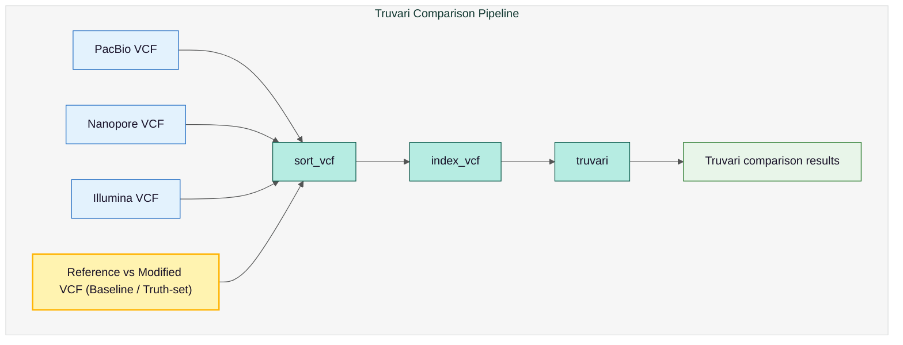

# VCF Comparison with Truvari Output

## Pipeline Workflow

The flowchart illustrates the Truvari comparison pipeline for structural variant (SV) analysis. The Reference vs Modified VCF (that is output by the pipeline where reference and modified fasta are compared) serves as the baseline or truth-set, against which VCFs from PacBio, Nanopore, and Illumina sequencing are compared. The pipeline begins with sorting the VCF files (sort_vcf), indexing them (index_vcf), and then performing the Truvari comparison to generate the final comparison results.



## Directory Structure

```
truvari/
├── SampleName_sv_short_read.vcf.gz
├── SampleName_sv_short_read.vcf.gz.csi
├── SampleName.pacbio_sv_long_read.vcf.gz
├── SampleName.pacbio_sv_long_read.vcf.gz.csi
├── SampleName.ont_sv_long_read.vcf.gz
├── SampleName.ont_sv_long_read.vcf.gz.csi
├── ref_x_modsyri.vcf.gz
├── ref_x_modsyri.vcf.gz.csi
├── ref_x_modsyri_SampleName_sv_short_read_truvari       → folder comparing short-read SV pipeline with reference-to-modified fasta pipeline
├── ref_x_modsyri_SampleName.pacbio_sv_long_read_truvari → folder comparing PacBio long-read SV pipeline to reference-to-modified fasta pipeline
└── ref_x_modsyri_SampleName.ont_sv_long_read_truvari    → folder comparing Nanopore long-read SV pipeline to reference-to-modified fasta pipeline
```

## Description

This folder contains all structural variant (SV) callsets and their **Truvari benchmarking results** comparing SVs detected from sequencing data with the structural variants derived from the **reference vs modified genome comparison (SyRI)**.

## Reference SV Callsets

### `ref_x_modsyri.vcf.gz`
Structural variants derived from comparing the **reference genome** and the **modified genome** using **SyRI**.

### `SampleName_sv_short_read.vcf.gz`
Structural variants detected from **Illumina short reads**.

### `SampleName.pacbio_sv_long_read.vcf.gz`
Structural variants detected from **PacBio long reads**.

### `SampleName.ont_sv_long_read.vcf.gz`
Structural variants detected from **Oxford Nanopore long reads**.

All `.csi` files represent index files for fast querying of VCF contents.

## Truvari Comparison Result Folders

Each Truvari output directory contains benchmarking results comparing the **SyRI structural variants** against sequencing-based SV calls:

### `ref_x_modsyri_SampleName_sv_short_read_truvari/`
Comparison between SyRI SVs and SVs called from **Illumina short reads**.

### `ref_x_modsyri_SampleName.pacbio_sv_long_read_truvari/`
Comparison between SyRI SVs and SVs called from **PacBio long reads**.

### `ref_x_modsyri_SampleName.ont_sv_long_read_truvari/`
Comparison between SyRI SVs and SVs called from **Oxford Nanopore long reads**.

Each Truvari output folder usually contains:

- Matched SV calls
- Unmatched (false negative / false positive) calls
- Precision, recall, and F1 scores
- Comparison summary statistics

## Tools Used

The table below summarises all tools used within the pipeline:

| **Tool**     | **Link for Further Information**                      |
| ------------ | ----------------------------------------------------- |
| **Truvari**  | [Truvari GitHub](https://github.com/ACEnglish/truvari)|
| **BCFtools** | [BCFtools](https://samtools.github.io/bcftools/)      |

## Citation

* English, A.C., Menon, V.K., Gibbs, R.A. et al. Truvari: refined structural variant comparison preserves allelic diversity. Genome Biol 23, 271 (2022). https://doi.org/10.1186/s13059-022-02840-6

* Twelve years of SAMtools and BCFtools
Petr Danecek, James K Bonfield, Jennifer Liddle, John Marshall, Valeriu Ohan, Martin O Pollard, Andrew Whitwham, Thomas Keane, Shane A McCarthy, Robert M Davies, Heng Li GigaScience, Volume 10, Issue 2, February 2021, giab008, https://doi.org/10.1093/gigascience/giab008

## See Also

- [Reference vs Modified Processing Pipeline Output](fasta-ref-mod.md) - SyRI baseline variants
- [Short-Read Processing Pipeline Output](illumina.md) - Short-read SV calls
- [Long-Read Processing Pipeline Output](long-reads.md) - Long-read SV calls
