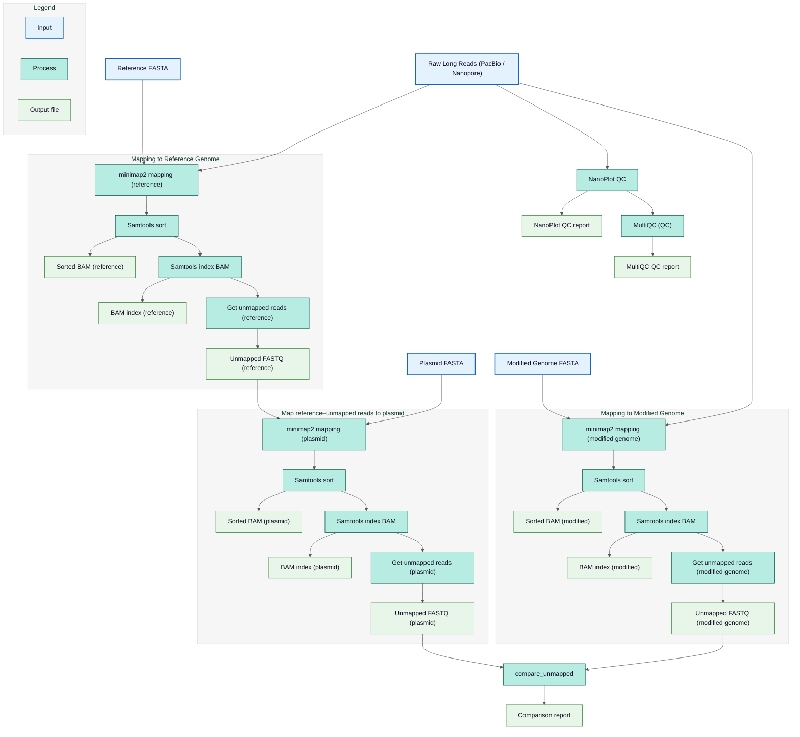
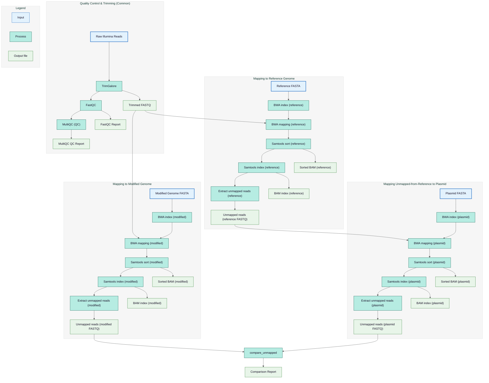

# Unmapped Reads Statistics

## Directory Structure

```
unmapped_stats/
├── SampleName_short_read_stats.txt
├── SampleName_pacbio_read_stats.txt
└── SampleName_ont_read_stats.txt
```

## Description

This folder contains read mapping comparisons between the reference genome and the modified/assembled genome for short-read and long-read processing pipelines.

Each file summarizes:

- Reads mapping to both reference and modified assemblies
- Reads mapping only to reference
- Reads mapping only to modified
- Used to compare assembly quality and detect assembly-related differences

## File Descriptions

| File                               | Description                                                                                |
| ---------------------------------- | ------------------------------------------------------------------------------------------ |
| `SampleName_short_read_stats.txt`  | Mapping comparison of Illumina short reads between reference and modified assemblies       |
| `SampleName_pacbio_read_stats.txt` | Mapping comparison of PacBio long reads between reference and modified assemblies          |
| `SampleName_ont_read_stats.txt`    | Mapping comparison of Oxford Nanopore long reads between reference and modified assemblies |

Each report includes:

- Total input reads
- Number of unmapped reads
- Percentage of unmapped reads
- Mapping target (reference or modified genome)

## File Content Format

Each mapping statistics file includes:

```
Pair IDs: <sample> reference vs <sample> modified
Intersected Reads: <number>
Unique Reads <sample> reference: <number>
Unique Reads <sample> modified: <number>
```

## Graphical Visualization of Long-Read Preprocessing Pipeline

The flowchart below illustrates the preprocessing workflows applied to long reads to obtain mapping statistics.



## Graphical Visualization of Short-Read Preprocessing

The flowchart below illustrates the preprocessing workflows applied to short reads to obtain mapping statistics.



## See Also

- [Short-Read Processing Pipeline Output](illumina.md) - Short-read mapping details
- [Long-Read Processing Pipeline Output](long-reads.md) - Long-read mapping details
- [Runtime Messages](../nextflow/runtime-messages.md) - Pipeline execution messages
